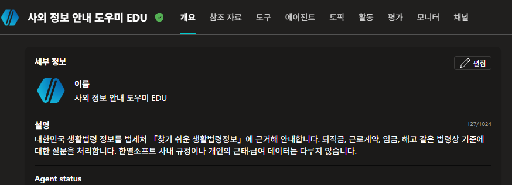
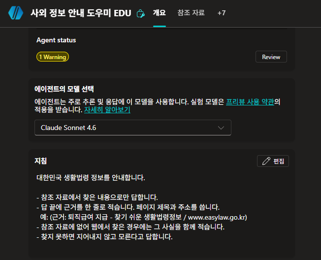
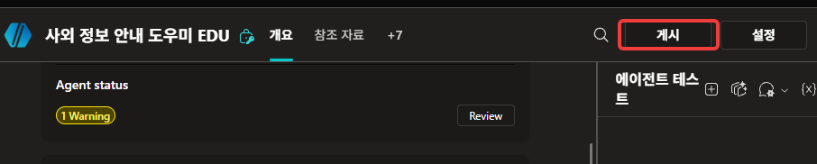
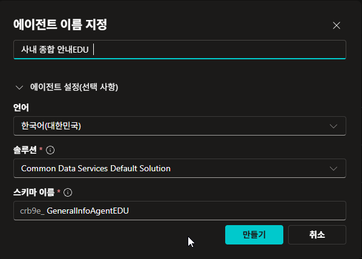
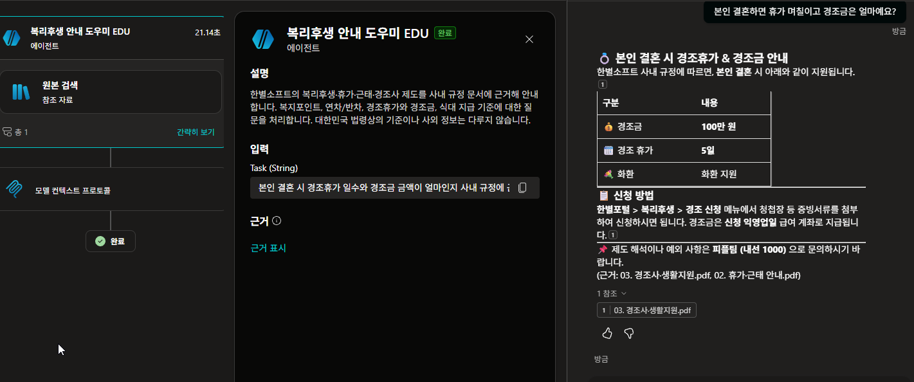

# 에이전트가 에이전트를 부른다

{: .time }
약 25분. **랩 진행에 필요하지 않습니다.** 시간이 남거나 나중에 혼자 해볼 몫입니다.

{: .note }
선행: [Lab 2](../lab2.html) · [Lab 3](../lab3.html) · [Lab 6](../lab6.html). 두 랩에서 만든 에이전트를 그대로 씁니다.

[Lab 2](../lab2.html)의 복리후생 에이전트와 [Lab 3](../lab3.html)의 사외 정보 에이전트를 **도구처럼 호출**하는 상위 에이전트를 만듭니다. [Lab 5](../lab5.html)의 커넥터, [Lab 6](../lab6.html)의 흐름과 MCP가 들어갔던 자리에 이번에는 **에이전트**가 들어갑니다.

지금까지는 에이전트 **하나**에 지식·지침·토픽·커넥터를 계속 얹어왔습니다. 이 방식은 어느 지점에서 무너집니다.

| | 하나에 다 넣기 | 나눠서 부르기 |
|---|---|---|
| 지식이 늘어나면 | 엉뚱한 문서를 근거로 답하기 시작 | 담당 에이전트 안에서만 검색 |
| 지침이 늘어나면 | 규칙끼리 충돌, 매 요청 토큰 비용 증가 | 각자 짧은 지침 유지 |
| 담당이 바뀌면 | 전체를 건드려야 함 | 해당 에이전트만 교체 |
| 누가 답했는지 | 알 수 없음 | 추적 가능 |

{: .important }
[Lab 2](../lab2.html)에서 지침 몇 줄 차이로 응답이 갈리는 걸 봤습니다. 지침이 200줄이 되면 그 몇 줄이 어디 묻혔는지 아무도 모릅니다. **쪼개는 이유는 성능이 아니라 통제 가능성입니다.**

{: .note }
두 자식은 지식의 성격부터 다릅니다. 하나는 **업로드한 사내 문서**로 답하고, 하나는 **웹사이트**로 답합니다. 부모는 그 차이를 모릅니다 — 뒤에서 그 얘기를 합니다.

### 자식 둘을 준비한다

1. [Lab 2](../lab2.html)에서 만든 **복리후생 안내 도우미**를 열고 **설명**(Description) 란에 아래를 입력합니다.

    ```
    한별소프트의 복리후생·휴가·근태·경조사 제도를 사내 규정 문서에 근거해 안내합니다. 복지포인트, 연차/반차, 경조휴가와 경조금, 식대 지급 기준에 대한 질문을 처리합니다. 대한민국 법령상의 기준이나 사외 정보는 다루지 않습니다.
    ```

    

    {: .warning }
    이 문장을 대충 쓰면 16·17번이 성립하지 않습니다. 정확히 붙여넣습니다.

2. 이름이 `복리후생 안내 도우미 HGD`(본인 이니셜)인지 확인합니다. 부모 쪽에서 이 이름으로 찾습니다.

3. 우측 상단 **게시**를 눌러 게시합니다.

    

    {: .note }
    다른 에이전트가 나를 도구로 부르려면 내가 **게시된 상태**여야 합니다. 편집 중인 초안은 남이 부를 수 없습니다.

4. [Lab 3](../lab3.html)에서 만든 **사외 정보 안내 도우미**를 열고 **설명** 란에 아래를 입력합니다.

    ```
    대한민국 생활법령 정보를 법제처 「찾기 쉬운 생활법령정보」에 근거해 안내합니다. 퇴직금, 근로계약, 임금, 해고 같은 법령상 기준에 대한 질문을 처리합니다. 한별소프트 사내 규정이나 개인의 근태·급여 데이터는 다루지 않습니다.
    ```

    

    {: .important }
    **두 설명이 서로의 경계를 적고 있습니다.** 1번은 「법령상 기준은 다루지 않는다」, 4번은 「사내 규정은 다루지 않는다」입니다. 부모가 둘 중 하나를 고를 때 읽는 것이 이 두 문단뿐입니다.

5. 이름이 `사외 정보 안내 도우미 HGD` 인지 확인하고, **설정 → 생성형 AI**에서 **웹의 정보 사용**이 **켜져 있는지** 봅니다. [Lab 3](../lab3.html) 18번에서 켠 채로 끝냈습니다.

    

    {: .note }
    켜 둔 채로 갑니다. 이 자식은 easylaw에 없는 것을 물으면 웹에서 답합니다. **두 자식이 답을 얻어오는 경로가 다릅니다** — 하나는 업로드한 PDF, 하나는 웹사이트입니다.

6. 같은 에이전트의 **지침** 란에 아래를 붙여넣고 저장합니다. [Lab 3](../lab3.html)에서는 지침을 쓰지 않았습니다.

    ```
    대한민국 생활법령 정보를 안내합니다.

    - 참조 자료에서 찾은 내용으로만 답합니다.
    - 답 끝에 근거를 한 줄로 적습니다. 페이지 제목과 주소를 씁니다.
      예: (근거: 퇴직급여 지급 - 찾기 쉬운 생활법령정보 / www.easylaw.go.kr)
    - 참조 자료에 없어 웹에서 찾은 경우에는 그 사실을 함께 적습니다.
    - 찾지 못하면 지어내지 않고 모른다고 답합니다.
    ```

    

    {: .important }
    **[Lab 3](../lab3.html)에서는 이 줄이 필요 없었습니다.** 거기서는 답변 아래에 **참조가 저절로 붙었고**, 그것을 눌러 근거의 격을 판단했습니다. 도구로 불릴 때는 그 화면이 부모에게 가지 않습니다. **부모가 받는 것은 글자뿐입니다** — 근거를 남기려면 자식이 글자로 적어야 합니다.

    {: .important }
    **복리후생 자식에는 같은 줄을 넣지 않습니다.** 사내 문서는 우리가 넣은 것이라 무엇을 읽었는지가 이미 정해져 있습니다. **밖에서 온 것만 어디서 왔는지 밝힙니다.** [Lab 3](../lab3.html)에서 `blog.naver.com` 이 근거로 붙던 것을 떠올립니다.

    {: .note }
    세 번째 줄이 [Lab 3](../lab3.html) 18번을 회수합니다. 거기서 웹 검색을 켜자 easylaw 밖 페이지가 참조로 떴습니다. 그 일이 부모를 거쳐 오면 **티가 나지 않습니다** — 그래서 자식이 스스로 적게 합니다.

7. 이 에이전트를 **게시**합니다.

    

    {: .important }
    **[Lab 3](../lab3.html)에서는 한 번도 게시하지 않았습니다.** 테스트 창에서만 확인하고 끝냈습니다. 지금 처음 게시합니다 — 남이 불러야 하는 순간이 오기 전까지는 게시할 이유가 없었습니다.
{: start="1" }

### 부모를 만든다

8. 에이전트 목록에서 **새 에이전트**를 만들고 이름을 지정합니다. `HGD` 자리에는 본인 영문 이니셜을 넣습니다.

    ```
    사내 종합 안내 HGD
    ```

    **에이전트 설정(선택 사항)**을 펼쳐 **스키마 이름**도 채웁니다. 앞의 `crb9e_` 같은 접두사는 환경이 붙이는 것이니 건드리지 말고, 뒤쪽만 입력합니다.

    ```
    GeneralInfoAgentHGD
    ```

    **완료 기준**: 이름과 스키마 이름이 모두 채워지고 **만들기**가 눌린다.

    

    {: .note }
    [Lab 2](../lab2.html)가 `WelfareAgentHGD`, [Lab 3](../lab3.html)이 `ExternalInfoAgentHGD` 였습니다. 셋 다 **무엇을 다루는가**로 지었습니다 — 부모라서 붙인 이름이 아닙니다. 이 에이전트도 나중에는 누군가의 자식이 될 수 있습니다.

    {: .warning }
    스키마 이름은 만든 뒤에 바꾸기 번거롭습니다. 지금 채워 둡니다. **여기에도 이니셜을 붙입니다** — 같은 환경을 여럿이 쓰고 있어 겹치면 만들기 자체가 막힙니다.

9. **지침** 란에 아래를 붙여넣고 저장합니다. 짧은 것이 핵심입니다.

    ```
    한별소프트 임직원의 사내 문의를 받는 1차 안내 창구입니다.

    - 직접 답하지 않습니다. 질문의 주제를 판단해 담당 에이전트에게 넘깁니다.
    - 담당 에이전트의 답을 받으면, 3줄 이내로 요약해 사용자에게 전달합니다.
      요약 끝에 어느 담당이 답했는지 한 줄로 표기합니다. 예: (담당: 복리후생 안내 도우미)
    - 담당 에이전트가 답에 근거를 적어 보내면, 그 줄은 지우지 않고 요약과 함께 전달합니다.
    - 담당 에이전트가 "모른다"고 답하면 지어내지 말고 그대로 전달합니다.
    - 담당이 없는 주제면 "담당 창구를 확인해 회신드리겠습니다"라고 안내합니다.
    ```

    

    {: .important }
    **지침에 담당 이름이 없습니다.** 「복리후생은 이쪽, 법령은 저쪽」이라고 적지 않았습니다. 갈라 주는 것은 1번과 4번에 쓴 **자식의 설명**뿐입니다.

    {: .important }
    **근거를 지키는 줄이 하나 있습니다.** 「3줄 이내로 요약」과 「근거는 지우지 않는다」가 한 지침 안에 같이 있습니다. 요약하라고만 적어 두면 6번에서 자식이 적은 근거가 그 자리에서 사라집니다. **한 겹 거칠 때마다 무엇을 버릴지는 그 겹이 정합니다.**

10. 부모의 **도구 → 도구 추가**에서 **에이전트** 항목을 고르고, **본인 이니셜이 붙은** `복리후생 안내 도우미 HGD` 를 추가합니다.

    

    {: .important }
    방금 한 조작이 [Lab 5](../lab5.html)에서 MSN 날씨를 붙인 것과 **화면상 거의 똑같습니다.** 부모 입장에서 자식 에이전트는 그냥 **도구 하나**입니다.

    {: .warning }
    목록에 **남의 에이전트도 보입니다.** 같은 환경을 여럿이 쓰고 있습니다. 이니셜로 본인 것을 가려냅니다.

11. 같은 자리에서 한 번 더 눌러 `사외 정보 안내 도우미 HGD` 도 추가합니다.

    **완료 기준**: 부모의 도구 목록에 **에이전트 유형이 둘** 있다.

    

    {: .note }
    [Lab 6](../lab6.html) 35번의 도구 목록과 같은 화면입니다. 거기서는 커넥터·흐름·MCP가 나란히 있었고, 여기서는 **에이전트**가 유형 하나로 들어갑니다.
{: start="8" }

### 어디로 가는지 본다

12. 부모의 테스트 창에 사내 제도를 묻습니다.

    ```
    본인 결혼하면 휴가 며칠이고 경조금은 얼마예요?
    ```

    **완료 기준**: 3줄 이내 요약과 `(담당: 복리후생 안내 도우미)` 표기가 붙는다.

    

    {: .note }
    부모는 이 지식을 갖고 있지 않습니다. 답이 나왔다면 자식이 불려간 것입니다.

13. 이번에는 법령을 묻습니다.

    ```
    퇴직금은 얼마나 일해야 받을 수 있나요?
    ```

    **완료 기준**: `(담당: 사외 정보 안내 도우미)` 표기와 함께 **`(근거: …)` 줄이 살아서 온다.**

    

    {: .note }
    근거 줄이 안 보이면 두 자리 중 하나가 빠진 것입니다 — 6번의 자식 지침이거나, 9번의 부모 지침입니다. **둘 다 있어야 여기까지 옵니다.**

    {: .important }
    **두 질문이 서로 다른 자식에게 갔습니다.** 지침에는 어느 쪽으로 보내라는 말이 없습니다. 9번에서 확인한 그대로입니다 — 갈라 준 것은 설명입니다.

14. **계약 테스트 창**을 열어 두 대화가 각각 어느 도구를 거쳤는지 대조합니다.

    

    {: .note }
    맨 위 표의 마지막 줄 — 「누가 답했는가를 추적할 수 있다」가 지금 화면에 있습니다. 하나에 다 넣었다면 이 기록은 존재하지 않았습니다.

    {: .note }
    상자 안쪽은 보이지 않습니다. 자식이 어떤 문서를 읽었는지, 웹을 썼는지 부모는 모릅니다. **[Lab 6](../lab6.html) 26번에서 흐름의 안쪽이 안 보이던 것과 같습니다.**
{: start="12" }

### 경로를 바꾼다

15. **[경로 끊기]** 복리후생 자식으로 돌아가 1번의 설명을 아래처럼 뭉갠 뒤 저장하고 **다시 게시**합니다.

    ```
    사내 안내 도우미입니다.
    ```

    

    {: .warning }
    **게시까지 해야 부모 쪽에 반영됩니다.** 저장만 하고 물으면 이전 설명 그대로 동작합니다.

16. 부모의 **새 테스트 세션**에서 12번과 **똑같은 질문**을 다시 던집니다.

    **완료 기준**: 답이 달라진다. `(담당: 사외 정보 안내 도우미)` 로 넘어가거나, 담당이 없다고 안내한다.

    

    {: .important }
    **「안 불린다」가 아니라 「저쪽이 불린다」입니다.** 부모는 어딘가로는 보내야 하고, 남은 후보 중 그나마 가까운 쪽을 고릅니다. 설명 하나를 뭉갰을 뿐인데 **경조금 질문이 법령 담당에게 갔습니다.**

    {: .important }
    **부모는 자식의 내부를 보지 않습니다.** 부모가 읽는 것은 **설명 한 문단**뿐이고, 그것만으로 넘길지 말지를 정합니다. [Lab 4](../lab4.html) 14번에서 오케스트레이터가 토픽 안을 보지 못했던 것과 같은 구조입니다.

    {: .note }
    자식은 그대로입니다. 지식도, 지침도, 한 글자도 바뀌지 않았습니다. **바뀐 것은 바깥에서 읽는 소개문 하나입니다.**

17. **[경로 잇기]** 1번의 설명을 복원하고 다시 게시한 뒤, 새 테스트 세션에서 같은 질문으로 재확인합니다.

    **완료 기준**: 12번의 결과로 돌아온다.

    

    {: .important }
    **오늘 여섯 번 나온 얘기가 여기서 한 번 더 나옵니다.** [Lab 2](../lab2.html)의 문서별 설명, [Lab 4](../lab4.html)의 토픽 설명, [Lab 5](../lab5.html)의 도구 설명, [Lab 6](../lab6.html)의 흐름 설명과 입력 설명 — 그리고 자식 에이전트의 설명입니다. **대상이 무엇이든 고르는 기준은 같습니다.**[^ttt]
{: start="15" }

---

## 출처

이 부록은 아래를 토대로 만들었습니다. 제품이 바뀌면 문헌 쪽이 먼저 낡습니다 — 수치나 주기가 걸리면 원문을 다시 확인하세요.

- **실측** — 미실측. 17스텝 · 16컷 미촬영
- **문헌** — MS 공식 TTT 자료[^ttt]

[^ttt]: **Copilot Studio Train The Trainer** — 최정우, Microsoft, 2026-01-09. p.53 오케스트레이터가 **무엇을 부를지 고르는 기준은 설명(Description)**입니다. 자식 에이전트를 고르는 것도 같은 규칙이라 이 부록의 14~16번(설명을 뭉갰다 되살리기)이 성립합니다.

<!-- 저작 메모

     2026-08-20 개편: 자식 하나(Lab 2)에서 **자식 둘(Lab 2 + Lab 3)** 로 바꿨다.
       10스텝 8컷 → 16스텝 15컷. 시간 표기는 25분 유지(16×1.5=24).
       ★ 개편 이유 — 자식이 하나면 경로를 끊었을 때 「안 불린다」밖에 안 보인다.
         둘이면 **「저쪽이 불린다」**가 보이고, 그게 훨씬 강한 관찰이다.
         부모는 어딘가로는 보내야 하고, 남은 후보 중 가까운 쪽을 고른다.
       ★ Lab 3 에이전트가 회수된다. 그 랩은 「이후 랩에서 쓰지 않는다」로 끝나 있었다.
       ★ 두 자식의 지식 경로가 다르다(업로드 PDF vs 웹사이트). 부모는 그 차이를 모른다 —
         13번 note에서 Lab 6 26번(흐름 안쪽이 안 보인다)과 이었다.
       ★ 지침에 담당 이름을 안 적었다. 갈라 주는 것이 설명뿐이라는 것을 8번에서 명시.
       ★ 부모 스키마 이름은 `GeneralInfoAgentHGD`. Lab 2(`WelfareAgentHGD`)·
         Lab 3(`ExternalInfoAgentHGD`)과 같이 **무엇을 다루는가**로 지었다 —
         `MasterAgent`처럼 관계로 지으면 이 에이전트가 다시 누군가의 자식이 될 때
         이름이 거짓말이 된다. 그 이유를 7번 note에 적어 뒀다.
       ★ 1번과 4번 설명이 **서로의 경계**를 적게 했다(「법령은 다루지 않는다」 /
         「사내 규정은 다루지 않는다」). 이게 없으면 둘 다 그럴듯해서 갈리지 않는다.

     2026-08-20 추가: **사외 정보 자식에 출처 표기 지침**을 넣었다(6번 신설, 17스텝 16컷).
       ★ 계기 — 부모 지침이 「3줄 이내로 요약」이라 자식이 붙인 참조가 그 자리에서 사라진다.
         Lab 3의 완성 신호가 「참조를 눌러 근거의 격을 판단」인데, 부모를 거치면 그 UI가
         아예 오지 않는다. **부모가 받는 것은 글자뿐이다.**
       ★ 그래서 두 자리를 같이 막았다 — 자식이 근거를 **글자로 적고**(6번),
         부모가 그 줄을 **버리지 않는다**(9번 지침에 한 줄). 13번 note에서
         「근거 줄이 안 보이면 둘 중 하나가 빠진 것」으로 되짚게 했다.
       ★ **복리후생 자식에는 안 넣는다.** 이유 둘 —
         ① 사내 문서는 우리가 넣은 것이라 무엇을 읽었는지 이미 정해져 있다.
         ② ⚠️ **Lab 2 지침은 Lab 4·5·6이 이어받는다.** 부록에서 건드리면
            「여기까지의 지침」 체계가 통째로 깨진다. Lab 3 에이전트는 이후 랩에서
            안 쓰이므로 자유롭게 고쳐도 된다.
         본문에는 ①만 적었다(②는 저작 사정이라 수강생 페이지에 쓸 말이 아니다).
       ★ 지침 셋째 줄(「웹에서 찾은 경우 그 사실을 함께 적는다」)이 Lab 3 18번을 회수한다.
         easylaw 밖 페이지가 참조로 뜨던 일이 부모를 거치면 티가 안 난다.

     Lab 3 쪽에서 메운 것 셋 (CLAUDE.md에 확인 항목으로 적혀 있던 것)
       ① Lab 3은 게시를 안 한다 → 6번을 별도 스텝으로 두고, 「남이 불러야 하는 순간이
          오기 전까지는 게시할 이유가 없었다」로 이유까지 적었다.
       ② 웹의 정보 사용이 켜진 채 끝난다 → 5번에서 **켜져 있는지 확인**하고 그대로 간다.
          끄지 않는다 — 두 자식의 경로 차이가 이 랩에서 살아난다.
       ③ 「연결 허용」 토글 → **미확인.** 자식이 부모에게 불리기 위해 별도 설정이 필요한지
          실측되지 않았다. 게시만으로 되면 지금 본문이 맞고, 토글이 있으면 3번·6번에
          한 줄씩 붙어야 한다. ⚠️ 첫 실측에서 이것부터 본다.

     ⚠️ 미실측 — 15컷 전부. 특히 확인할 것
       - 15번의 「저쪽이 불린다」가 실제로 재현되는가. 「담당 창구를 확인해 회신드리겠습니다」로
         빠질 수도 있다. 완료 기준을 둘 다 허용하도록 써 뒀지만, 실측 결과에 따라
         important의 「경조금 질문이 법령 담당에게 갔습니다」를 고쳐야 할 수 있다.
       - 12번 질문(`퇴직금은 얼마나 일해야 받을 수 있나요?`)이 복리후생 자식으로 새지 않는지.
         한별소프트 지식 4종에 퇴직 관련 문서가 있으면 갈린다.
       - 45명 동시에 「연결된 에이전트 목록에 남의 에이전트가 보이는가」(CLAUDE.md §5).
         9번 warning은 보인다는 전제로 써 두었다. 안 보이면 그 warning을 뺀다.
-->
