# Lab 5. 커넥터 — 읽고, 계산하고, 쓴다 🔌

> **이번 랩 완성물**: [커넥터](./glossary.html#connector) 세 개를 붙여 바깥을 **읽고**(날씨·단가표) → 읽은 값으로 **계산하고** → 결과를 Excel에 **쓰는** 에이전트
> **예상 시간**: 40분 · **완성 신호**: 신청 한 건이 Excel 시트에 실제로 한 줄로 남는다. 그리고 그 직후, **확인 절차 없이 여러 건이 한 번에 바뀌는 것**을 목격한다

{: .time }
40분 타이머. 4단(손이 생긴다 → 읽는다 → 계산한다 → 쓴다)으로 나눠 진행합니다.

---

## 준비

- **[Lab 2](./lab2.html)에서 만든 복리후생 안내 도우미**에 이어서 작업합니다. [Lab 4](./lab4.html)에서 토픽을 얹은 그 에이전트입니다.
- [Lab 2](./lab2.html) 스텝 9에서 `오늘 서울 날씨 어때?` 를 물었을 때 에이전트가 뭐라고 했는지 떠올려 두세요. 잠시 뒤 같은 질문을 다시 던집니다.
- Excel 파일 하나를 **본인 OneDrive for Business에 각자 업로드**해 둡니다.

    [정산_기준표.xlsx 내려받기](../assets/download/정산_기준표.xlsx)

    {: .warning }
    파일은 반드시 **개인별로 각자 업로드**합니다. 공용 파일을 여럿이 동시에 건드리면 파일 락과 참조 꼬임이 생깁니다.

- 파일 안에는 표가 **2개** 들어 있습니다. 열어서 구조만 먼저 눈에 익혀 두세요.

    **테이블 `단가표`** — 읽기만 합니다

    | 구간코드 | 구간명 | 단가 | 적용일 |
    |---|---|---|---|
    | TR-01 | A구간 | 12,000 | 2026-01-01 |
    | TR-02 | B구간 | 18,500 | 2026-01-01 |
    | TR-03 | C구간 | 24,000 | 2026-01-01 |
    | TR-04 | D구간 | 31,000 | 2026-01-01 |
    | TR-05 | E구간 | 45,000 | 2026-01-01 |

    

    **테이블 `신청내역`** — 여기에 씁니다. 머리글만 있고 데이터는 없습니다.

    | 신청번호 | 신청자 | 구간코드 | 수량 | 금액 | 상태 |
    |---|---|---|---|---|---|
    | | | | | | |

    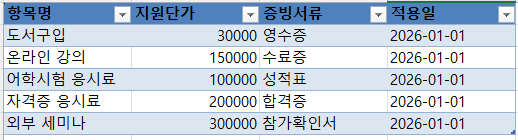

    {: .note }
    두 표 모두 **Excel 테이블**로 지정되어 있습니다. 머리글에 필터 단추가 붙어 있는 것이 그 표시입니다. 커넥터의 「테이블에 있는 행 나열」은 셀 범위가 아니라 **테이블 이름**을 받으므로, 값만 입력하고 테이블로 지정하지 않으면 뒤에서 목록에 아무것도 뜨지 않습니다.

## 개념 (5분)

{: .time }
이 5분은 아래 「예상 시간 40분」에 포함되지 않습니다.

지금까지 만든 에이전트가 아는 것은 **우리가 준 문서**([Lab 2](./lab2.html))와 **지정한 웹사이트**([Lab 3](./lab3.html))뿐입니다. 둘 다 읽기만 합니다.

| | 무엇을 하나 | 예 |
|---|---|---|
| 지식 | 무엇을 **아는가** | 사내 규정 문서, 공개 웹사이트 |
| 커넥터 | 무엇을 **할 수 있는가** | 날씨 조회, Excel 읽기·쓰기 |

**커넥터는 손입니다.** [Lab 2](./lab2.html)에서 날씨 질문이 막혔던 것은 에이전트가 몰라서가 아니라 손이 없어서였습니다.

{: .important }
**읽는 손과 쓰는 손은 무게가 다릅니다.** 읽기는 틀려도 화면 안에서 끝나지만, 쓰기는 바깥이 바뀝니다. 이 랩은 읽기로 시작해 쓰기로 끝나고, **마지막에 그 차이가 무엇을 뜻하는지** 직접 보게 됩니다.

<!-- 저작 메모(2026-08-11 신설 — 구 Lab 5 + 구 Lab 6 병합).
     시간표 슬롯 `connector-basic`(5분) + `request-lookup-notify`(30분) → 40분 1개 랩.

     ★ 병합 근거(2026-08-11 편성 결정)
       오케스트레이터가 똑똑해질수록 제어 가능 영역이 줄고, 그중 가장 많이 줄어든 것이
       토픽이다. 토픽(Lab 4)과 흐름(Lab 6)이 "내가 정하는" 축이므로 거기에 시간을
       몰아주고, 커넥터 두 랩을 하나로 합쳐 재원을 만들었다.
       오후 편성: Lab 4 토픽 70 / Lab 5 커넥터 40 / Lab 6 흐름+MCP 60 / 피날레 10 = 180

     ★ 흐름이 필요한 이유가 이 랩에서 두 갈래로 쌓인다(사용자 정리 2026-08-11).
         읽는 조건  11번 — 표를 통째로 읽어 온다. 개수·필터를 못 건다.
         실행 순서  23번 — 확인 없이 일괄로 쓴다.
       이 둘이 흐름의 최소 요구사항이다. 25번을 두 갈래로 다시 써서 랩이 그
       두 문제를 남기고 닫히게 했다.
       ⚠️ 흐름을 "쓰기 안전장치"로만 소개하면 절반만 말하는 것이다. 읽기 조건이
         그 안에 들어간다. Lab 6 개념 절을 쓸 때 이 두 갈래로 열 것.

     ★ 병합으로 좋아진 것 — ④ 절의 문제 제기가 **다음 랩에서 바로 풀린다.**
       구 Lab 6은 "확인 없는 일괄 쓰기"를 보여주고 "이건 중급 과정의 첫 주제"로
       미뤘다. 이제 Lab 6이 에이전트 흐름이므로 그날 안에 답이 나온다.
       ⚠️ 다만 랩 페이지에 다음 랩 예고를 쓰지 않는다(2026-08-10 규칙).
         27번은 경계를 본인 말로 적게만 하고 끝낸다. 잇는 것은 강사 구두다.

     ★ 구 Lab 5(5분·4스텝)에서 살린 것
       MSN 날씨로 "붙는다/호출된다"만 눈으로 보여주는 최소 호출. ① 절이 그것이다.
       Lab 2 스텝 9(범위 밖 질문 = 날씨)와의 대구가 이 랩의 문이므로 유지한다.

     ★ 새로 넣은 것 — 12번 지침에서 도구를 `/` 로 지목(사용자 요청 2026-08-11).
       Lab 4 12번(토픽 지목)과 같은 방식이고, 지목하면 오케스트레이터 유도가
       확실해진다. 토픽과 도구가 같은 자리에서 같은 문법으로 불린다는 것이
       하루의 축 하나를 완성한다.
       → Lab 4 12번 note에 "Lab 6에서 커넥터를 붙이고 나면 같은 자리에 도구 이름이
         뜬다"고 예고해 두었다. 병합으로 Lab 5가 됐으므로 그쪽 링크를 고쳤다.

     ★ 계약 테스트 창을 이 랩에서도 쓴다(5·9·16번). Lab 4 24번에서 익힌 것이다.
       도구는 토픽보다 호출 여부가 더 안 보이므로 여기서 더 요긴하다.

     ★ 차수별 오버레이 교체 지점 — 준비 절의 `단가표` 5행. 이 밖에 고객사 고유명을
       넣지 말 것. 구 Lab 6 메모의 "Lab 4 카드 선택목록" 지점은 Lab 4 개편으로
       사라졌으므로 교체 지점은 이제 여기 한 곳뿐이다.

     ⚠️ MSN Weather 커넥터가 테넌트 DLP에 막히면 ① 절이 통째로 불성립한다.
       2026-08-13 리허설 최우선 확인 항목.
     ★ 2026-08-11 실측(1~5번, 9컷)
       - 도구 유형 라벨이 **「커넥터」**, 계약 테스트 창의 라벨은 **「커넥터 동작」**.
         Lab 4의 「토픽」과 달라서 무엇이 불렸는지 종류까지 구분된다.
       - ⚠️ `오늘 날씨 어때?` 만 하면 **도시명을 되묻는다.** 도구의 입력값도
         Lab 4 25~27번의 슬롯 필링과 같은 방식으로 채워진다는 뜻이다.
         초안은 `오늘 서울 날씨 어때?` 로 한 번에 답하게 했으나, 되묻는 쪽이
         가르칠 것이 더 많아 그대로 살렸다. 5번 콜아웃으로 Lab 4와 이었다.
       - 구 5번(테스트)과 구 6번(계약 테스트 창)을 합쳤다. 계약 테스트 창을 켠 채로
         테스트하면 한 화면에 다 나온다. 27 → 26스텝.
       - 연결 만들기가 4컷이다(03·03b·03c·03d). 스텝은 하나로 둔다.

     ★ 2026-08-11 실측 2차(6~8번, 6컷) — 순서가 초안과 달랐다.
       실제 흐름: 도구 추가 → 커넥터 탭 → Excel → 작업 선택 → **추가 및 구성**
                → **세부 정보(설명)** → **입력(값 지정)**
       초안은 입력 → 설명 순이었다. 설명이 먼저 나온다.
       - 「도구 추가」 위쪽에 **새로 만들기**(에이전트 흐름 · 프롬프트 · 모델 컨텍스트
         프로토콜 · 컴퓨터 사용)가 있고, 아래 탭이 커넥터 · 프롬프트 · 흐름 ·
         REST API · 모델 컨텍스트 프로토콜 다섯이다. 6번 note에 탭만 적었다
         (랩 예고는 쓰지 않는다는 규칙 때문에 "다음 랩에서"는 안 붙였다).
       - 연결은 계정 단위여서 3번에서 만든 것이 그대로 잡힌다. 다시 만들지 않는다.
       - ★ 세부 정보의 설명 칸 위에 제품이 직접 「오케스트레이터가 어떻게 식별하는지에
         대한 설명입니다」라고 써 두었다. 하루 네 번째 같은 얘기를 제품 문구로 못박았다.
       - ⚠️ **입력 칸마다 「사용자 지정 값 / AI로 동적으로 채우기」를 고른다.**
         `Table`의 기본이 「AI로 동적으로 채우기」다. 이 파일에는 표가 둘이라
         그대로 두면 `신청내역`을 읽고 단가를 답할 수 있다. 8번에서 고정하게 했다.
         → Lab 4 25번(변수를 입력으로 열지 말지)과 같은 결정이 칸 단위로 반복된다.
           "맡길 것과 쥘 것"이 이 랩에서도 같은 문장으로 나온다.

     ★ 2026-08-11 실측 3차(8~11번)
       - ⚠️ **도구가 불리면 계약 테스트 창이 자동으로 펼쳐진다.** 직접 켜는 스텝이
         필요 없어 구 10번(계약 테스트 창 확인)을 9번에 흡수했다. 26 → 25스텝.
       - 도구 호출 상세는 토픽보다 많이 보여준다 — **설명 · 입력 · 출력**이 다 나온다.
         Lab 4 24번에서는 설명까지였다. 9번 콜아웃으로 대조했다.
       - `Table` 칸이 화면에서는 `단가표`인데 실행 시에는 내부 식별자(GUID)로 간다.
         값이 이상해 보여 당황할 지점이라 note로 적었다.
       - 답 끝에 `(근거: 정산 구간코드별 단가 기준표)` 가 붙는다. Lab 2 지침의 근거
         표기 규칙이 도구에도 그대로 걸린다.
       - ★ 세부 정보에 **「사용할 자격 증명」**이 있다(사용자 제보 2026-08-11).
         기본은 「작성자가 제공한 자격 증명」. 실배포는 「최종 사용자 자격 증명」이
         일반적이지만, 교육에서는 로그인 알림창 빈도를 낮추려고 작성자 쪽으로 둔다.
         7번 note에 넣었다.

     ★ 2026-08-11 실측 4차(13~16번)
       - 15번 설명이 실제와 어긋나 있었다. "그 뒤에 계산은 도구 없이 이루어진 것을
         확인한다"고 썼는데, 화면에는 **볼 것이 없는 것**이 요지다. 상자가 하나뿐이고
         곱셈이 기록된 자리가 없다. 완료 기준을 "상자가 하나뿐이다"로 바꿔 관찰
         가능하게 고쳤다.
       - 자기 참조 오류 둘(15번이 "15번 대화", 25번이 "25번에서 본 것")도 같이 잡았다.
         재번호 때마다 생기므로 커밋 전 자기참조 스캔을 돌릴 것.
       - 11번 실측에서 하나 나왔다. TR-99를 물으면 없다고만 하지 않고 **등록된
         코드를 전부 보여준다.** 「테이블에 있는 행 나열」이 특정 행을 찾는 것이
         아니라 표를 통째로 읽어 오기 때문이다. 읽어 오는 양을 우리가 정하지
         못한다는 점을 note로 붙였다 — 참고 페이지 2부(토큰·비용)와 이어진다.

     ★ 2026-08-11 실측 5차(17~22번) — ⚠️ 22번에서 큰 게 나왔다.
       기록은 되는데 **값이 칸을 밀려서 들어간다.**
         신청번호=접수 / 구간코드=교육 / 수량=96000 / 금액=TR-03 / 상태=4
       원인은 「테이블에 행 추가」 도구에 **칸마다 값을 지정하는 자리가 없기** 때문이다.
       대상 테이블만 고르고 나머지는 오케스트레이터가 짝지어 넣는다.
       20번 도구 설명에 "신청자·구간코드·수량·금액·상태를 한 행으로 추가한다"고
       적었지만 그건 **무엇을**이지 **어디에**가 아니다.
       → 결함이 아니라 재료다. 흐름이 필요한 세 번째 이유가 됐다.
         25번 표를 두 갈래에서 **세 갈래**로 늘렸다(읽는 조건 / 쓰는 자리 / 실행 순서).
       → Lab 6 20번(행 추가 액션의 칸↔값 연결 표)이 정확히 이것의 답이다.
       ⚠️ 지침으로 고쳐보는 스텝은 넣지 않았다. 넣으면 "지침으로 되네"가 되어
         이 랩의 축(커넥터의 한계)이 흐려지고, 결과가 매번 같다는 보장도 없다.
         다만 그런 방법이 있다는 것 자체는 22번 note로 인정하고 넘어간다.

     ★ 대조 자료 — 안성진(MS) copilot-studio-for-makers 기본 Lab 04의 29·31번.
       https://sdstony.github.io/copilot-studio-for-makers/basic/lab04-build-agent-with-tools-for-m365.html
       거기서는 Excel 「테이블에 행 추가」의 File 칸을 「AI로 채우기」로 두고
       지침에 "이전 단계 output에서 Id를 파싱해 이런 패턴의 문자열을 추출할 것",
       Row 칸에는 `{ "개수": 2, "단가": "100,000", "품목명": "사과" }` 형식을 지시한다.
       → 우리는 반대로 간다(제작자 판단 2026-08-11). 근거 둘.
         1. Lab 5 8번에서 읽기의 「AI로 동적으로 채우기」를 이미 껐다. 쓰기에서
            다시 켜면 같은 랩 안에서 방향이 뒤집힌다.
         2. 되돌릴 수 없는 작업일수록 해석이 끼어들 자리를 줄여야 한다. 형식을
            문장으로 지시하면 그 문장도 매번 해석되고, 어긋나면 이미 파일이 바뀐 뒤다.
       TTT가 비즈니스 유저 코스에서 경계한 대목과 같은 논지다. 청중이 다르면
       판단도 달라지는 자리이지 어느 쪽이 틀린 것이 아니다.

     ★ 샘플 파일의 `신청내역` 테이블에서 빈 행을 뺐다(2026-08-11).
       ref를 A1:F2 → A1:F1(머리글만)로 고쳤다. 22번 스크린샷에서 2행이 비고 3행에
       기록되어 혼란스러웠다. ⚠️ lab5-00b(신청내역 테이블) 재촬영 필요.

     ★ 2026-08-11 실측 7차(23b·24번) — 일괄 추가는 성립한다. 그리고 예상보다 세다.
       - 다섯 건이 확인 없이 들어간다. 계약 테스트 창에 「행 추가」가 잇달아
         여러 번 찍힌다(호출 횟수와 실제 행 수가 딱 맞지 않을 수 있다 — 몇 번
         부를지도 우리가 정하지 않는다).
       - ★ **값이 다섯 줄 전부 22번과 같은 방식으로 밀려 들어간다.**
         구간코드=교육 / 수량=12000 / 금액=TR-01 / 상태=1 / 신청번호=접수 / 신청자=빈칸
       - ★★ **답변의 표는 정확하다.** TR-01은 12,000원으로 맞게 표시된다.
         에이전트가 몰라서가 아니다. **아는 것과 옮기는 것이 다른 일**이라는 것이
         이 랩에서 가장 센 대목이다.
       - ★★ 그러고서 **「5건 모두 정상 접수 및 기록 완료」**라고 보고한다. 도구가
         완료를 돌려줬으니 성공으로 본 것이고 무엇이 들어갔는지는 확인하지 않는다.
         → 22번의 한 줄짜리 어긋남이 다섯 줄이 되고, 아무도 알려주지 않는다.
           24번을 이 대비로 다시 썼다. Lab 6 20번의 무게가 여기서 결정된다.

     ★ ⚠️ 2026-08-11 실측 6차(23번) — 설계 전제가 뒤집혔다.
       `신청내역 전부 상태를 승인으로 바꿔줘` 가 **실행되지 않는다.** 붙인 도구가
       「행 나열」과 「행 추가」뿐이고 「행 업데이트」가 없기 때문이다. 당연한
       결과인데 초안은 "확인 없이 실행되는 장면을 목격한다"로 써 두었다.
       구 Lab 6에서 미실측인 채로 넘어온 문장이다.
       → 대신 화면이 더 좋은 것을 준다. 에이전트가 지원하지 않는다고 답하면서
         **지금 할 수 있는 일을 나열한다**(구간코드별 단가 조회 / 신청 내역 신규 등록).
         "붙인 도구가 곧 능력의 경계"가 화면 하나로 나온다.
       → 23번을 두 요청의 대비로 다시 짰다.
           없는 기능  상태 변경        → 못 한다
           있는 기능  다섯 건 일괄 신청 → 확인 없이 다 한다
         일괄 *변경*이 아니라 일괄 *추가*로 바꾸면 도구가 있으므로 성립한다.
       → 25번 세 번째 갈래를 "실행 순서"에서 **"쓰는 범위"**로 바꿨다.
         한 번에 몇 건까지 쓸지, 확인을 받을지를 정하지 못했다는 것이 정확하다.
       ⚠️ 일괄 추가(다섯 건)가 실제로 한 번에 되는지는 미실측. 안 되면 세 번째
         갈래를 다시 잡아야 한다. lab5-23b·24 촬영 때 확인할 것.

     미실측 25번(스크린샷 없음). 스크린샷 33/33컷 — ⚠️ lab5-00b만 재촬영 대기. -->

## 단계 — ① 도구를 붙이면 손이 생긴다 (8분)

1. 화면 **상단 메뉴**에서 **도구**를 엽니다. **완료 기준**: 도구 목록이 열린다.

    

    {: .note }
    [Lab 4](./lab4.html) 5번의 노드 메뉴에 있던 **도구 추가**가 이것입니다. 토픽 안에서 부를 수도 있고, 여기서 에이전트 전체에 붙일 수도 있습니다. 오늘은 뒤쪽으로 합니다.

2. **도구 추가**에서 `MSN` 을 검색해 **MSN 날씨**(MSN Weather)의 **현재 날씨 가져오기** 작업을 고릅니다.

    

3. **연결**을 만듭니다. 연결이 없으면 도구를 부를 수 없습니다.

    

    

    

    **완료 기준**: 연결이 만들어졌다는 표시가 뜬다.

    

    {: .note }
    **연결은 도구와 별개입니다.** 도구는 「무엇을 할 수 있는가」이고 연결은 「누구의 자격으로 하는가」입니다. 같은 도구라도 연결이 없으면 부를 수 없습니다.

4. **에이전트에 추가**를 선택합니다.

    

    **완료 기준**: 도구 목록에 `현재 날씨 가져오기` 가 보이고, 유형이 **커넥터**로 표시된다.

    

5. **새 테스트 세션**을 열고, 테스트 창 우측 상단의 **계약 테스트 창**을 켠 상태로 물어봅니다.

    ```
    오늘 날씨 어때?
    ```

    **어느 지역인지 되묻습니다.** 아래를 답합니다.

    ```
    서울
    ```

    **완료 기준**: 실제 기온과 날씨가 나온다. 그리고 왼쪽에 `현재 날씨 가져오기` 가 **커넥터 동작**으로 기록된다.

    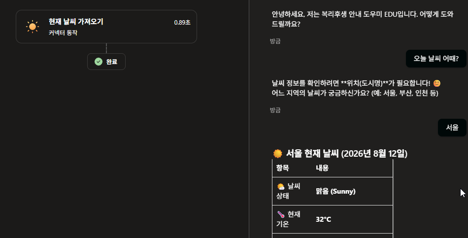

    {: .important }
    **같은 에이전트, 같은 질문, 같은 지침입니다.** 달라진 것은 도구 하나뿐입니다. [Lab 2](./lab2.html)에서 이 질문이 막혔던 것은 몰라서가 아니라 **손이 없어서**였습니다.

    {: .important }
    **되물은 것에 주목합니다.** 이 도구는 도시명을 입력으로 받는데 첫 질문에 그것이 없었습니다. [Lab 4](./lab4.html) 25~27번에서 본 것과 같은 일입니다 — **비어 있으면 묻고, 채워져 있으면 묻지 않습니다.** 처음부터 `오늘 서울 날씨 어때?` 라고 하면 한 번에 답합니다.

    {: .important }
    왼쪽 라벨이 [Lab 4](./lab4.html)에서 본 **토픽**이 아니라 **커넥터 동작**입니다. **도구는 토픽보다 불렸는지가 더 안 보입니다.** 토픽은 답의 문장이 통째로 달라져 눈치챌 수 있지만, 도구가 준 값은 문장 안에 섞여 들어갑니다. 기온이 그럴듯하면 지어낸 것인지 가져온 것인지 구분되지 않습니다. **이 랩에서 계약 테스트 창을 [Lab 4](./lab4.html)보다 더 자주 씁니다.**

## 단계 — ② 밖의 데이터를 읽는다 (9분)

6. **도구 추가**를 엽니다. 위쪽은 **새로 만들기**, 아래쪽은 이미 있는 것을 고르는 자리입니다. 아래에서 **커넥터** 탭을 고르고 **Excel Online(Business)** 를 선택합니다.

    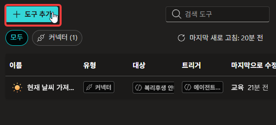

    

    {: .note }
    아래 탭이 **커넥터 · 프롬프트 · 흐름 · REST API · 모델 컨텍스트 프로토콜** 다섯 가지입니다. 도구를 붙이는 방법이 이만큼 있다는 뜻이고, 오늘 쓰는 것은 그중 첫 번째입니다.

    작업 목록에서 **테이블에 있는 행 나열**을 고릅니다.

    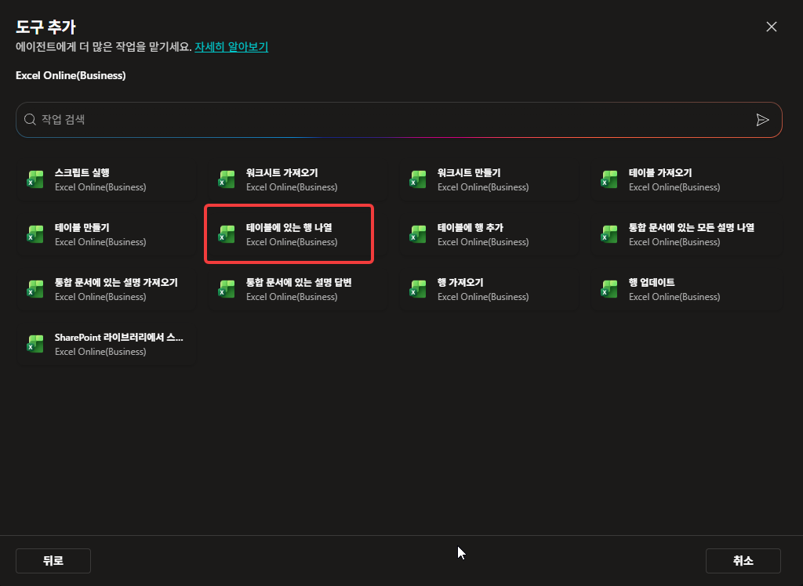

    **완료 기준**: 작업 설명과 연결 계정이 보이는 화면이 뜬다. **추가 및 구성**을 누릅니다.

    

    {: .note }
    연결이 이미 잡혀 있습니다. 3번에서 만든 것과 같은 계정이라 다시 만들지 않습니다. **연결은 계정 단위**여서 커넥터마다 새로 만들 필요가 없습니다.

7. **세부 정보** 화면이 열립니다. **설명**을 아래로 바꿔 씁니다.

    ```
    정산 구간코드별 단가를 조회한다. 구간코드·구간명·단가·적용일이 들어 있는 기준표를 읽는다.
    ```

    **완료 기준**: 설명이 우리 용도로 바뀌었다.

    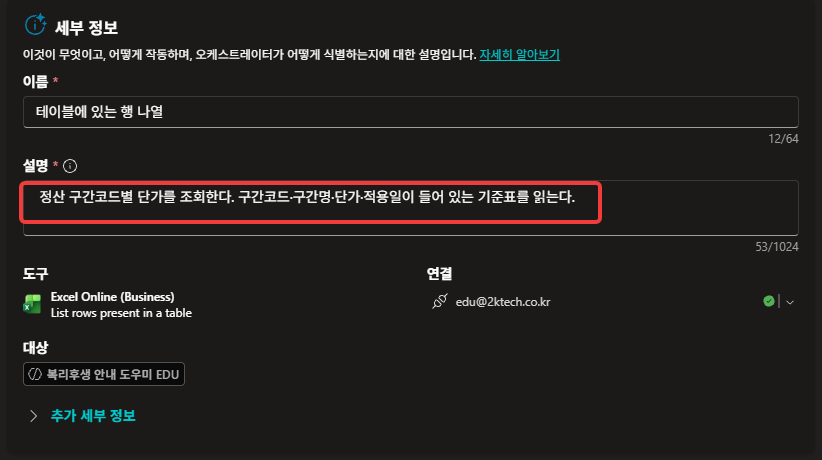

    {: .important }
    **제품이 화면에 직접 적어 두었습니다.** 설명 칸 위에 「이것이 무엇이고, 어떻게 작동하며, **오케스트레이터가 어떻게 식별하는지**에 대한 설명입니다」라고 쓰여 있습니다. [Lab 2](./lab2.html) 16번의 문서별 설명, [Lab 4](./lab4.html) 4번의 토픽 작업 설명과 **같은 얘기가 오늘 네 번째로** 나옵니다.

    {: .note }
    **사용할 자격 증명**은 날씨 때와 마찬가지로 **「작성자가 제공한 자격 증명」** 그대로 둡니다. 만든 사람의 연결로 도구가 돌아간다는 뜻입니다. 실제로 배포할 때는 **「최종 사용자 자격 증명」** 을 쓰는 것이 일반적입니다 — 쓰는 사람이 각자 자기 권한으로 접근해야 남의 파일을 보게 되지 않기 때문입니다. 오늘은 **로그인 알림창이 자주 뜨는 것을 줄이려고** 작성자 쪽으로 둡니다.

    {: .note }
    기본 설명은 「테이블에 있는 행을 나열합니다」입니다. 틀린 말은 아니지만 우리 질문과 이어지지 않습니다. `단가`·`구간코드` 같은 **우리 쪽 말**이 들어가야 걸립니다.

8. **입력** 항목으로 내려갑니다. 네 칸을 아래처럼 채웁니다.

    | 입력 이름 | 채우는 방법 | 값 |
    |---|---|---|
    | Location | 사용자 지정 값 | OneDrive for Business |
    | Document Library | 사용자 지정 값 | 문서 |
    | File | 사용자 지정 값 | 본인이 올린 `정산_기준표.xlsx` |
    | Table | **사용자 지정 값** | `단가표` |

    **완료 기준**: 네 칸이 모두 채워지고, `Table`이 **AI로 동적으로 채우기**가 아니라 **사용자 지정 값**으로 바뀌어 있다.

    

    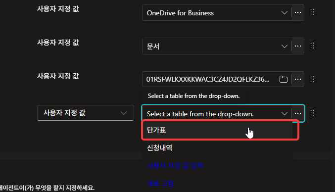

    {: .important }
    **`Table`의 기본값이 「AI로 동적으로 채우기」입니다.** 그대로 두면 어느 표를 읽을지 오케스트레이터가 그때그때 정합니다. 이 파일에는 표가 둘이라 **`신청내역`을 읽어 놓고 단가를 답할 수 있습니다.** 고정할 수 있는 것은 고정합니다.

    {: .note }
    칸마다 「사용자 지정 값」과 「AI로 동적으로 채우기」 중에 고를 수 있습니다. [Lab 4](./lab4.html) 25번에서 변수를 **입력으로 열지 말지** 정한 것과 같은 결정입니다 — **맡길 것과 쥘 것을 칸 단위로 정합니다.**

    {: .warning }
    `File` 칸이 긴 코드로 보입니다. 파일 아이콘을 눌러 목록에서 고르면 **본인 파일**을 확실히 지정할 수 있습니다.

9. **새 테스트 세션**에서 물어봅니다.

    ```
    TR-02 단가가 얼마야?
    ```

    **완료 기준**: `18,500` 이 응답에 나오고, **계약 테스트 창이 저절로 열리면서** 왼쪽에 `테이블에 있는 행 나열` 이 **커넥터 동작**으로 기록된다.

    

    {: .note }
    도구가 불리면 계약 테스트 창이 **알아서 펼쳐집니다.** 5번처럼 직접 켤 필요가 없습니다.

    {: .important }
    **토픽 때보다 보이는 것이 많습니다.** 왼쪽 상자를 누르면 7번에 쓴 **설명**, 8번에 지정한 **입력**, 그리고 도구가 돌려준 **출력**이 다 나옵니다. [Lab 4](./lab4.html) 24번에서는 설명까지만 보였습니다.

    {: .note }
    `Table` 칸에 우리가 고른 `단가표` 대신 **긴 코드**가 들어가 있습니다. 화면에서 고른 이름이 내부 식별자로 바뀌어 전달된 것입니다. 값이 이상해 보여도 정상입니다.

    {: .note }
    답 끝에 `(근거: 정산 구간코드별 단가 기준표)` 가 붙어 있습니다. [Lab 2](./lab2.html)에서 지침에 쓴 **근거 표기 규칙이 도구에도 그대로 적용**된 것입니다.

    {: .warning }
    호출 기록이 **없는데 답이 나온 경우**가 있습니다. 그때 나온 `18,500` 은 표에서 읽은 값이 아닙니다. [Lab 2](./lab2.html) 부록에서 본 가짜 근거와 같은 일이 숫자로 일어난 것입니다.


10. 호출을 확실하게 만듭니다. **지침**의 「답변 원칙」 아래에 한 줄을 더합니다. 도구 이름 자리에서 **`/`** 를 누르면 목록이 뜹니다.

    ```
    - 구간코드별 단가 조회는 /테이블에 있는 행 나열 도구로 한다. 표에 없는 코드는 없다고 답하고 값을 추측하지 않는다.
    ```

    **완료 기준**: 도구 이름이 **아이콘 붙은 칩**으로 바뀐다. 저장합니다.

    

    {: .important }
    **[Lab 4](./lab4.html) 12번에서 토픽을 지목한 것과 같은 자리, 같은 방법입니다.** 지침에서 무엇을 부를지 적는 문법이 토픽과 도구에 공통입니다. `<<` 로도 같은 목록이 열립니다.

    {: .note }
    9번의 설명이 **판정 근거를 늘리는 것**이라면, 이 줄은 **실행을 지시하는 것**입니다. 둘은 다른 일을 합니다.

11. **새 테스트 세션**에서 10번을 다시 하고, 이번에는 표에 없는 코드도 물어봅니다.

    ```
    TR-02 단가가 얼마야?
    TR-99 단가가 얼마야?
    ```

    **완료 기준**: 앞은 `18,500` 이 나오고 도구 호출이 기록된다. 뒤는 **없다고 답하고 숫자를 만들지 않는다.**

    

    {: .important }
    **없다고만 하지 않고 등록된 구간코드를 전부 보여줍니다.** 이 도구가 `TR-99` 한 줄을 찾아본 것이 아니라 **표를 통째로 읽어 왔기** 때문에 가능한 답입니다. 이름 그대로 「테이블에 있는 행 나열」입니다.

    {: .note }
    표가 다섯 행이라 부담이 없지만, 수천 행짜리 표에 같은 도구를 붙이면 매번 그 전부가 오케스트레이터에게 넘어갑니다. **읽어 오는 양은 우리가 정하는 것이 아니라 도구가 정합니다.**
{: start="6" }

## 단계 — ③ 읽은 값으로 계산한다 (10분)

12. **지침** 맨 아래에 아래 블록을 더하고 저장합니다.

    ```
    [정산 신청 처리]
    - 사용자가 정산 신청을 요청하면 구간코드와 수량을 확인한다. 둘 중 빠진 것이 있으면 먼저 되묻는다.
    - 금액은 단가 곱하기 수량으로 계산한다.
    - 처리 결과는 아래 형식으로 통보한다.

      [정산 신청 접수]
      구간: 구간코드 (구간명)
      단가: 단가원 곱하기 수량건
      금액: 금액원
      상태: 접수
    ```

    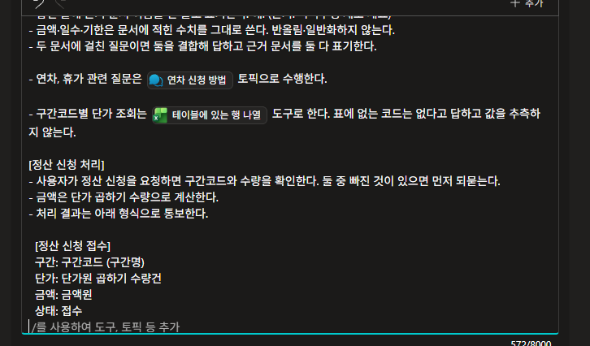

    {: .warning }
    붙여넣을 때 `-` 로 시작하는 줄과 대괄호는 그대로 두고, **숫자 목록이나 `*` 는 쓰지 않습니다.** 이 칸은 붙여넣은 글을 마크다운으로 해석합니다.

13. **새 테스트 세션**에서 신청해 봅니다.

    ```
    TR-03으로 4건 정산 신청할게요
    ```

    **완료 기준**: 응답이 `[정산 신청 접수]` 형식으로 나오고, 금액이 `96,000` 원(24,000 곱하기 4)으로 계산된다.

    

    {: .important }
    **세 가지가 한 번에 일어났습니다.** 사용자에게 받고(신청), 기준표를 찾아보고(조회), 정해진 형식으로 되돌려줬습니다(통보). 그런데 **아직 Excel에는 아무것도 쓰지 않았습니다.** 여기까지는 되돌릴 수 있습니다.

14. 수량을 빼고 물어봅니다.

    ```
    TR-01로 정산 신청할게요
    ```

    **완료 기준**: 수량을 되묻는다.

    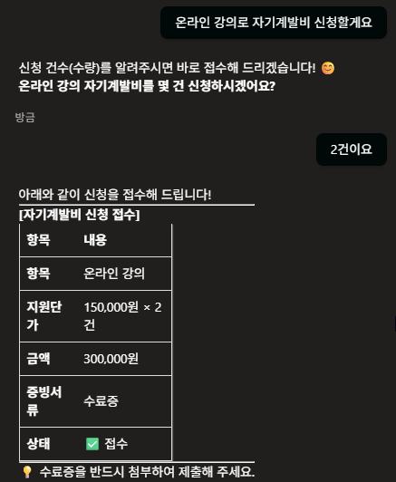

    {: .note }
    [Lab 4](./lab4.html)의 질문 노드가 하던 일을 지침 한 줄이 하고 있습니다. **다만 되묻는 문장도, 되묻는 시점도 매번 다릅니다.** 반드시 같아야 한다면 토픽으로 만듭니다.

15. 13번 대화의 **계약 테스트 창**을 열어 왼쪽에 무엇이 기록됐는지 봅니다.

    **완료 기준**: 상자가 **하나뿐**이다. `테이블에 있는 행 나열` 만 있고 그 아래는 바로 「완료」다.

    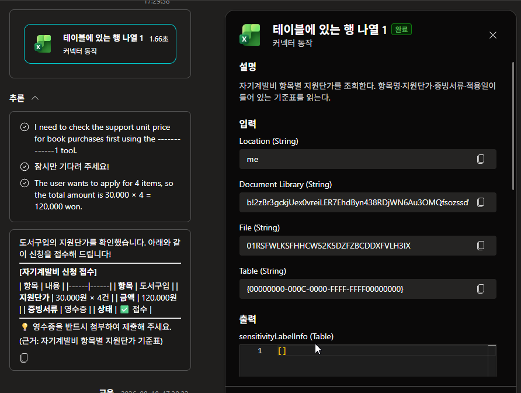

    {: .important }
    **금액을 계산한 자리가 화면에 없습니다.** 조회는 상자로 남았는데 곱셈은 아무 데도 기록되지 않았습니다. 표에서 읽은 `24,000` 은 근거가 있지만 `96,000` 은 **모델이 문장 안에서 곱한 값**입니다.

    {: .note }
    곱셈이 틀리는 일은 드뭅니다. 다만 **근거의 성격이 다릅니다** — 하나는 확인할 수 있고 하나는 확인할 자리가 없습니다.

16. 큰 수로 한 번 확인합니다.

    ```
    TR-05로 137건 정산 신청할게요
    ```

    **완료 기준**: `6,165,000` 원이 나온다(45,000 곱하기 137).

    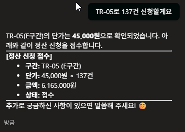

    {: .note }
    맞았다면 그대로 넘어갑니다. 틀렸다면 그것이 15번에서 말한 차이입니다. **어느 쪽이든 한 번은 검산해 보는 것이 이 스텝의 목적입니다.**

17. 여기까지의 도구 구성을 정리합니다. 도구 목록을 열어 지금 무엇이 붙어 있는지 봅니다.

    | 도구 | 무엇을 | 바깥이 바뀌나 |
    |---|---|---|
    | 현재 날씨 가져오기 | 읽기 | 아니오 |
    | 테이블에 있는 행 나열 | 읽기 | 아니오 |

    **완료 기준**: 지금까지 붙인 도구가 **전부 읽기**라는 것을 확인한다.

    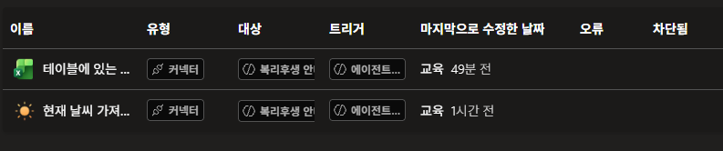
{: start="12" }

## 단계 — ④ 밖의 데이터를 바꾼다 (13분)

18. **도구 추가 → Excel Online (Business) → 테이블에 행 추가**를 선택합니다.

    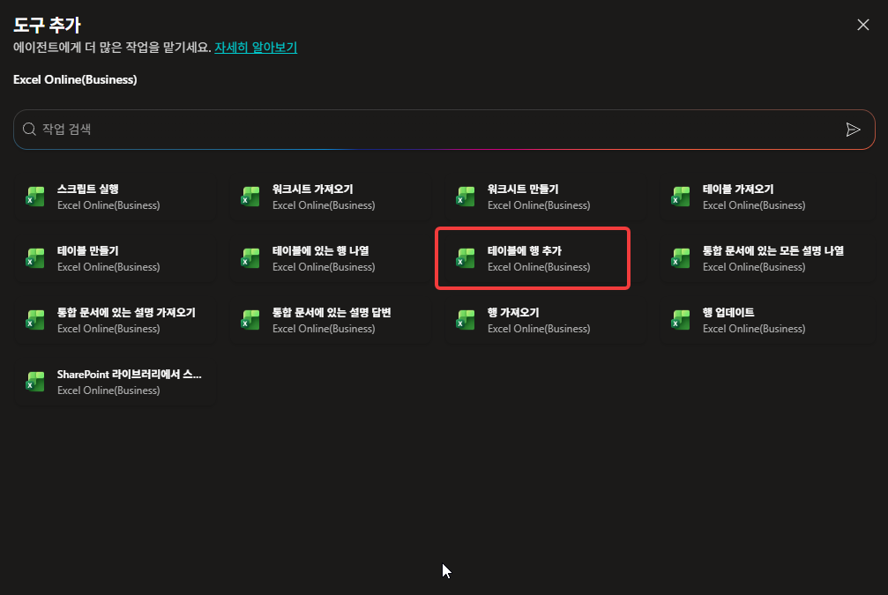

19. 대상 테이블을 **`신청내역`** 으로 지정하고 저장합니다. **완료 기준**: 도구 목록에 세 번째 작업이 보이고, 테이블 칸이 `신청내역`이다.

    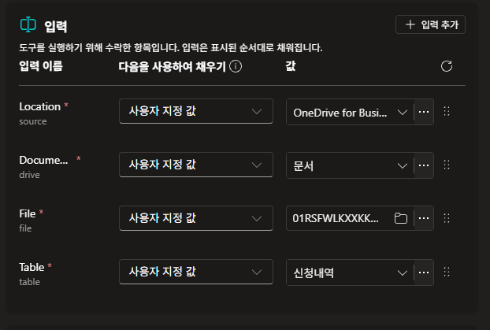

    {: .warning }
    테이블을 잘못 고르면 **`단가표`에 신청 내역이 쌓입니다.** 기준표가 망가지면 이 랩의 나머지가 전부 어긋납니다. 저장 전에 한 번 더 봅니다.

20. 도구의 **설명**을 아래로 바꿉니다.

    ```
    정산 신청 한 건을 신청내역 표에 기록한다. 신청자·구간코드·수량·금액·상태를 한 행으로 추가한다.
    ```

    

21. **새 테스트 세션**에서 신청하고 기록까지 시킵니다.

    ```
    TR-03으로 4건 정산 신청하고 신청내역에 기록해줘
    ```

    **완료 기준**: 기록했다는 응답이 나온다.

    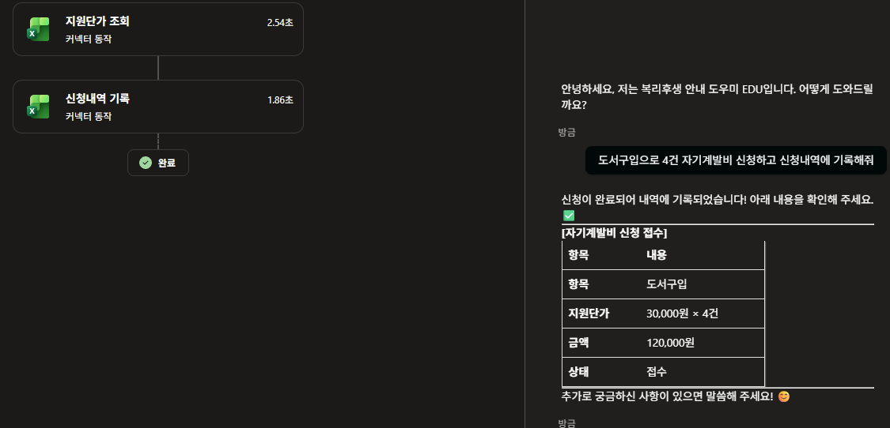

22. **OneDrive에서 Excel 파일을 직접 열어** 확인합니다.

    **완료 기준**: `신청내역` 테이블에 **한 줄이 실제로 추가**되어 있다. 그리고 **각 칸에 무엇이 들어갔는지** 하나씩 봅니다.

    

    {: .warning }
    **오늘 처음으로 되돌릴 수 없는 일을 했습니다.** 지금까지는 전부 화면 안에서 끝났지만, 방금은 파일이 바뀌었습니다. 테스트 세션을 닫아도 이 행은 남습니다.

    {: .important }
    **값이 엉뚱한 칸에 들어가 있습니다.** `신청번호`에 `접수`가, `금액`에 `TR-03`이, `상태`에 `4`가 들어가는 식입니다. 기록은 됐는데 **어느 값이 어느 칸으로 갈지는 아무도 정하지 않았습니다.**

    {: .note }
    20번의 설명에 「신청자·구간코드·수량·금액·상태를 한 행으로 추가한다」고 적었습니다. 무엇을 넣을지는 적었지만 **어디에 넣을지는 적지 않았습니다.** 그리고 이 도구에는 칸마다 값을 지정하는 자리가 없습니다 — 대상 테이블만 고릅니다.

    {: .note }
    사람이 보면 바로 틀린 것을 압니다. **다음 사람이 이 표를 읽을 때는 모릅니다.** 그때는 `TR-03`이 금액이 됩니다.

    {: .note }
    맞출 방법이 없지는 않습니다. 입력 칸을 **「AI로 동적으로 채우기」**로 두고, 넣을 형식을 `{ "구간코드": "TR-03", "수량": 4 }` 처럼 지시하면 짝이 맞아 들어가기도 합니다. **이 랩에서는 쓰지 않습니다.**

    {: .important }
    **8번에서 우리가 끈 것이 바로 그 스위치입니다.** 읽기에서 표를 잘못 고를까 봐 껐는데, 쓰기에서 다시 켜는 것은 방향이 반대입니다. **되돌릴 수 없는 작업일수록 해석이 끼어들 자리를 줄입니다.** 형식을 문장으로 지시하면 그 문장도 매번 해석되고, 어긋났을 때는 이미 파일이 바뀐 뒤입니다.

23. 두 가지를 시켜 보고 결과를 견줍니다. 먼저 **없는 기능**을 시킵니다.

    ```
    신청내역 전부 상태를 승인으로 바꿔줘
    ```

    **완료 기준**: **실행되지 않는다.** 지원하지 않는다고 답하고, **지금 할 수 있는 일을 대신 나열한다.**

    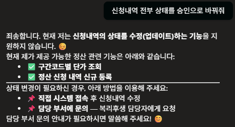

    {: .important }
    **붙인 도구가 곧 능력의 경계입니다.** 우리는 「행 나열」과 「행 추가」만 붙였고 「행 업데이트」는 붙이지 않았습니다. 그래서 고칠 수 없습니다. 지침으로 막은 것이 아니라 **수단이 없는 것**입니다.

    {: .note }
    없는 기능을 지어내지 않았다는 점도 봅니다. [Lab 2](./lab2.html)에서 근거가 없으면 없다고 답하게 한 것과 같은 태도가 도구에서도 나옵니다.

    이번에는 **있는 기능**으로 여러 건을 한 번에 시킵니다.

    ```
    TR-01부터 TR-05까지 각 1건씩 전부 신청하고 기록해줘
    ```

    **완료 기준**: 무엇을 쓸지 되묻지 않고 **다섯 건이 한 번에** 처리된다. 계약 테스트 창에 `테이블에 행 추가` 가 **잇달아 여러 번** 기록된다.

    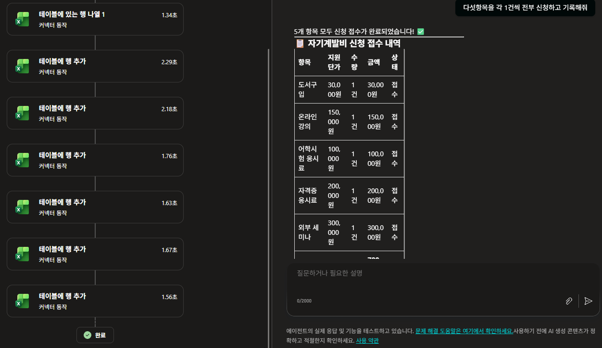

    {: .important }
    **경계 안에서는 확인이 없습니다.** 「행 추가」 도구 하나로 한 건도 다섯 건도 됩니다. 우리가 정한 것은 **어느 표에 쓸지**까지였고, **한 번에 몇 건을 쓸지**는 정한 적이 없습니다.

    {: .note }
    답변의 표를 보면 값이 **정확합니다.** `TR-01`은 12,000원, `TR-05`는 45,000원. 에이전트는 무엇을 써야 하는지 알고 있습니다. 다음 스텝에서 표에 실제로 무엇이 들어갔는지 봅니다.

24. **OneDrive에서 Excel 파일을 열어** 확인합니다.

    **완료 기준**: 다섯 줄이 들어가 있다. 그리고 **모든 줄의 값이 22번과 같은 방식으로 어긋나 있다.**

    

    {: .important }
    **화면에는 맞게 쓰고, 표에는 틀리게 썼습니다.** 23번의 답변에서 `TR-01 · 12,000원`은 정확했습니다. 그런데 표에는 `구간코드`에 `교육`이, `수량`에 `12000`이, `금액`에 `TR-01`이 들어갔습니다. **아는 것과 옮기는 것은 다른 일입니다.**

    {: .important }
    **그리고 「5건 모두 정상 접수」라고 보고했습니다.** 도구가 완료를 돌려줬으니 성공으로 본 것입니다. **무엇이 들어갔는지는 확인하지 않습니다.** 22번에서 한 줄이던 어긋남이 다섯 줄이 됐고, 아무도 알려주지 않았습니다.

    {: .note }
    `신청자` 칸은 다섯 줄 모두 비어 있습니다. 어긋난 것뿐 아니라 **빠진 것**도 있습니다.

    12번과 14번에서 쓴 지침을 다시 읽어 봅니다. **완료 기준**: **한 번에 몇 건까지인지, 쓰기 전에 확인을 받을지, 어느 값을 어느 칸에 넣을지**에 대한 문장이 하나도 없다는 것을 확인한다.

    {: .important }
    **막는 문장을 안 쓴 것이 아니라, 쓸 자리를 몰랐던 것입니다.** 12번에서 조회 도구를 지목했고 14번에서 통보 형식을 정했습니다. **둘 다 지켜졌습니다.** 지침은 우리가 떠올린 경우만 덮습니다.

25. 오늘 커넥터가 **못 한 것** 세 가지를 적고, 옆 사람과 맞춰 봅니다.

    | | 어디서 봤나 | 무엇을 못 했나 |
    |---|---|---|
    | 읽는 조건 | 11번 | 몇 개를, 어떤 조건으로 읽을지 정하지 못했다 |
    | 쓰는 자리 | 22번 | 어느 값을 어느 칸에 넣을지 정하지 못했다 |
    | 쓰는 범위 | 23번 | 한 번에 몇 건까지 쓸지, 확인을 받을지 정하지 못했다 |

    **완료 기준**: 세 가지를 본인 말로 설명할 수 있다.

    {: .important }
    **「테이블에 있는 행 나열」은 이름이 곧 한계입니다.** 나열만 합니다. 조건을 걸 자리가 없고, 입력을 하나 더 붙인다 해도 그 값을 오케스트레이터가 채우면 **매번 같다는 보장이 사라집니다.**

    {: .important }
    **도구를 붙이는 것은 능력을 주는 것입니다.** 23번의 두 요청이 그것을 보여줍니다 — 없는 도구는 아무리 시켜도 안 되고, 있는 도구는 아무리 많이 시켜도 됩니다. **경계는 도구 목록이 정하고, 그 안쪽은 열려 있습니다.**

    {: .important }
    **지침은 부탁이고, 절차는 강제입니다.** 확인 절차를 지침에 쓰면 대체로 지켜지지만 반드시 지켜지지는 않습니다. 여러 건을 한꺼번에 처리하는 일, 실패하면 되돌리는 일, 사람 승인을 받고 나서야 진행하는 일([HITL](./glossary.html#hitl)) — 이것들은 문장으로 부탁할 영역이 아닙니다.

    {: .note }
    [Lab 1](./lab1.html)에서 지침이 안 지켜지는 것을 봤고, [Lab 4](./lab4.html)에서 토픽으로 **대화**를 정해 두었습니다. 오늘 남은 것은 **실행**입니다 — 무엇을 어떤 조건으로 가져와 어떤 순서로 처리할지.
{: start="18" }

---

## 확인
- ① 커넥터 하나를 클릭 몇 번으로 붙였고, 같은 질문의 답이 달라지는 것을 확인했다
- ② **계약 테스트 창**으로 도구가 실제로 호출됐는지 확인했다
- ③ 도구의 **설명**을 우리 용도로 바꿔 썼다
- ④ 지침에서 **`/`** 로 도구를 지목해 호출을 확실하게 만들었다
- ⑤ 표에 없는 코드에 숫자를 만들어내지 않는 것을 확인했다
- ⑥ 가져온 값(단가)과 계산한 값(금액)의 차이를 구분할 수 있다
- ⑦ Excel에 **쓰기**를 했고, 파일이 실제로 바뀐 것을 눈으로 확인했다
- ⑧ 없는 도구는 못 하고, 있는 도구는 **확인 없이 여러 건도 하는 것**을 확인했다
- ⑨ 기록된 행의 값이 **칸과 어긋난 것**을 확인했다
- ⑩ 지침에 그 규칙이 없었다는 것을 원문에서 확인했다
{: .checklist }

---

## 여기까지의 지침

[Lab 4](./lab4.html) 상태에 **두 군데**가 더해졌습니다. 「답변 원칙」의 마지막 줄(10번)과 맨 아래 `[정산 신청 처리]` 블록(12번)입니다.

```
## 역할
한별소프트 임직원의 복리후생·근태 문의를 안내하는 사내 도우미. 한국어로 간결·정중하게, 업로드된 지식 문서에 근거해 답하고 없는 내용은 단정하지 않는다.

## 답변 원칙
- 반드시 업로드된 지식 문서만 근거로 답한다.
- 답변 끝에 근거 문서 이름을 한 줄로 표기한다. 예: (근거: 복리후생 제도 개요)
- 금액·일수·기한은 문서에 적힌 수치를 그대로 쓴다. 반올림·일반화하지 않는다.
- 두 문서에 걸친 질문이면 둘을 결합해 답하고 근거 문서를 둘 다 표기한다.
- 연차, 휴가 관련 질문은 /연차 신청 방법 토픽으로 수행한다.
- 구간코드별 단가 조회는 /테이블에 있는 행 나열 도구로 한다. 표에 없는 코드는 없다고 답하고 값을 추측하지 않는다.

## 경계
- 개인의 실제 데이터(내 잔여 연차, 내 별포인트 잔액, 내 급여)는 알 수 없다. 숫자를 추정하지 말고 "한별포털에서 확인하거나 피플팀(내선 1000)으로 문의해 주세요"라고 안내한다.
- 문서에 없는 내용은 지어내지 않는다. "제공된 문서에서 찾을 수 없습니다"라고 답한다.
- 규정의 해석·예외 적용 여부는 단정하지 않는다. 판단이 필요한 사안은 피플팀 확인으로 넘긴다.

[정산 신청 처리]
- 사용자가 정산 신청을 요청하면 구간코드와 수량을 확인한다. 둘 중 빠진 것이 있으면 먼저 되묻는다.
- 금액은 단가 곱하기 수량으로 계산한다.
- 처리 결과는 아래 형식으로 통보한다.

  [정산 신청 접수]
  구간: 구간코드 (구간명)
  단가: 단가원 곱하기 수량건
  금액: 금액원
  상태: 접수
```

`/연차 신청 방법`과 `/테이블에 있는 행 나열`은 화면에서 **칩**입니다. 통째로 붙여넣으면 글자가 되므로, 그 두 줄만 `/` 를 다시 입력해 목록에서 고릅니다.

24번에서 값이 칸을 밀려 들어간 것을 봤습니다. **그것을 막는 문장은 이 지침 어디에도 없습니다.** 25번에서 적은 세 문장이 [Lab 6](./lab6.html)에서 어떻게 해결되는지 보게 됩니다.
