# Lab 6. 도구를 만들고, 도구를 데려온다 🧩

> **이번 랩 완성물**: 조회 조건과 실행 순서를 내가 정한 **에이전트 흐름** 하나. 그리고 밖에서 가져온 **MCP 도구** 하나
> **예상 시간**: 50분 · **완성 신호**: [Lab 5](./lab5.html) 23번과 **똑같은 요청**을 던졌는데 값이 제자리에 들어간다

{: .time }
50분 타이머. 5단(흐름 만들기 → 읽는 조건 → 쓰는 자리와 순서 → 같은 요청 다시 → 도구 데려오기)으로 나눠 진행합니다.

---

## 준비

- **[Lab 5](./lab5.html)까지 마친 에이전트**와 **본인 OneDrive의 `정산_기준표.xlsx`** 를 그대로 씁니다.
- [Lab 5](./lab5.html) 25번에서 적은 세 문장을 꺼내 두세요. 이 랩은 그 셋을 하나씩 해결합니다.

## 개념 (5분)

{: .time }
이 5분은 아래 「예상 시간 50분」에 포함되지 않습니다.

[Lab 5](./lab5.html)에서 커넥터가 못 한 것이 세 가지였습니다.

| | [Lab 5](./lab5.html)에서 | 흐름에서는 |
|---|---|---|
| **읽는 조건** | 표를 통째로 가져왔다 (11번) | 몇 개를, 어떤 조건으로 읽을지 내가 적는다 |
| **쓰는 자리** | 값이 엉뚱한 칸에 들어갔고 성공으로 보고됐다 (22·24번) | 칸마다 무엇을 넣을지 내가 잇는다 |
| **쓰는 범위** | 다섯 건이 한꺼번에 들어갔다 (23번) | 입력이 한 건이라 한 건씩 나눠 쓴다 |

{: .important }
**흐름은 도구를 만드는 도구입니다.** 지금까지 붙인 커넥터는 만들어져 있는 것을 가져다 쓴 것이고, 흐름은 여러 동작을 묶어 새 도구 하나로 만드는 자리입니다. 오케스트레이터에게는 둘 다 그냥 도구 하나로 보입니다.

한 가지가 더 따라옵니다. **흐름은 적힌 것만 합니다.** 도구를 붙여 두면 오케스트레이터가 그 도구로 할 수 있는 일을 전부 시도할 수 있지만, 흐름은 그 안에 그려진 절차 밖으로 나가지 못합니다. 이것이 [Lab 5](./lab5.html) 23번의 답입니다.

| | 대화 | 실행 |
|---|---|---|
| 내가 정하는 것 | [Lab 4](./lab4.html) 토픽 | **Lab 6 흐름** |
| 맡기는 것 | 생성형 오케스트레이션 | 커넥터 직접 호출 |

<!-- 저작 메모(2026-08-11 신설 — 구 Lab 7을 부록으로 내리고 본문을 새로 씀).
     편성: 오후 180분 = Lab 4 토픽 70 / Lab 5 커넥터 50 / Lab 6 60 / 피날레 10.

     ★ 이 랩의 자리 — Lab 5가 남긴 세 문제를 하나씩 받는다.
       읽는 조건(Lab 5 11번) → ② 절 필터·상위 개수
       쓰는 자리(Lab 5 22번) → ③ 절 20번 칸↔값 연결 표
       쓰는 범위(Lab 5 23번) → ③ 절 입력 스키마 + ④ 절 "못 하게 된 것"
       ⚠️ 흐름을 "쓰기 안전장치"로만 소개하지 않는다. 읽기 조건과 쓰는 자리가 먼저다.

     ★ ④ 절이 이 랩의 결론이다. Lab 5의 「테이블에 행 추가」 도구를 떼고 흐름만
       남기면, `신청내역 전부 상태를 승인으로 바꿔줘` 가 실행되지 않는다.
       도구가 없으면 능력이 없고, 흐름은 적힌 것만 한다. Lab 1 부록의 "능력이
       없으면 사고도 없다"와 같은 문장이 실행 계층에서 다시 나온다.

     ★ MCP는 ⑤ 절 5스텝. Lab 3(웹사이트 지식)과 대조하는 자리로 쓴다.
       같은 "밖의 정보"인데 경로가 다르다 — Bing 인덱싱 경유 vs 직접 연결.

     ★ 부록 = 구 Lab 7 본문(연결된 에이전트) 10스텝을 그대로 이관.
       버리지 않은 이유: Lab 2 스텝 10의 「연결된 에이전트 허용」 토글이 이것을
       전제로 켜져 있고, 저작 비용이 0에 가깝다.
       ⚠️ 45명 동시 게시 시간이 최대 리스크라 본문에 두지 않았다.

     ⚠️ 미실측 — 전 스텝. 아래는 리허설에서 반드시 확인할 것.
       1. 에이전트 흐름 생성 경로와 트리거 이름 (도구 추가 → 새로 만들기 → 에이전트 흐름)
       2. 입력 파라미터 추가 UI
       3. Excel 「행 나열」의 고급 옵션에 필터 쿼리·상위 개수가 있는지
       5. 금액 계산을 어디서 하는지 (변수 설정 / 수식 / 응답 노드)
       6. 흐름 게시 소요시간 — 45명 동시면 이 랩 최대 리스크


     ★ 2026-08-11 실측(1~3번) — ①의 순서가 초안과 반대였다.
       - **이름을 먼저 바꾸면 저장되지 않는다.** 「초안 저장」을 먼저 눌러야
         「제목 없음」으로 잡히고, 그때부터 이름을 바꿀 수 있다. 2번을 뒤집었다.
       - 툴바 구성: 버전 기록 / 흐름 검사기 / 테스트 / **초안 저장** / **게시**.
         저장과 게시가 따로다. 10번 테스트가 이 툴바의 버튼이다.
       - ⚠️ 저장 직후 트리거 라벨이 **`manual`** 로 뜬다. 다른 화면에 갔다가
         재진입하면 「에이전트가 흐름을 호출할 때」로 바뀐다. 3번에 적었다.
       - ★ **응답 노드(Respond to the agent)가 처음부터 있다.** 초안 8번이
         "응답 노드를 추가한다"였는데 추가가 아니라 설정이다. 고쳤다.
         흐름이 무엇을 하든 에이전트에게 돌려주는 것으로 끝난다는 뜻이라
         note로 살렸다.

     ★ 50분은 본문(흐름 + MCP)만이다. 부록(A2A)은 별도이며 시간에 넣지 않는다.
       분량이 더 늘면 Lab 2의 참고 페이지처럼 별도 페이지로 빼는 선택지가 있다.
       Lab 6을 진행하면서 정한다(2026-08-11 보류).
     본문 전 스텝 실측 완료(35스텝·62컷). 부록 10스텝은 미실측·미촬영. -->

## 단계 — ① 흐름을 만든다 (16분)

1. **도구 → 도구 추가**를 엽니다. [Lab 5](./lab5.html) 6번에서 아래쪽 탭만 썼는데, 이번에는 위쪽 **새로 만들기**에서 **에이전트 흐름**을 고릅니다.

    

    {: .note }
    같은 화면입니다. **가져다 쓰는 자리와 만드는 자리가 나란히** 있습니다.

2. 흐름 편집기가 열립니다. **이름부터 바꾸려 하면 저장되지 않습니다.** 툴바의 **초안 저장**을 먼저 누르고, 그다음 좌측 상단 이름을 바꿉니다.

    ```
    정산 신청 처리
    ```

    **완료 기준**: 이름이 「제목 없음」에서 바뀌고, 다시 저장된다.

    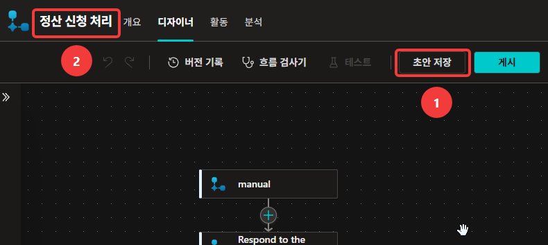

    {: .note }
    저장 버튼이 **초안 저장**이고 그 옆이 **게시**입니다. 둘은 다릅니다 — 초안은 나만 볼 수 있고, 에이전트가 부르려면 게시해야 합니다. 9번에서 게시합니다.

    {: .note }
    툴바에 **흐름 검사기**와 **테스트**가 있습니다. 10번에서 테스트를 씁니다.

3. **트리거** 노드를 봅니다. 방금 저장한 직후에는 이름이 `manual` 처럼 영문으로 보일 수 있습니다. **다른 화면에 갔다가 되돌아오면** 제 이름으로 표시됩니다.

    **완료 기준**: 트리거가 **「에이전트가 흐름을 호출할 때」**이고, 그 아래에 **「Respond to the agent」** 노드가 이미 놓여 있다.

    

    {: .important }
    **이 흐름은 사람이 시작하지 않습니다.** 일정이나 버튼이 아니라 에이전트가 부를 때만 돕니다. 그래서 트리거를 고를 일이 없습니다.

    {: .note }
    **응답 노드도 처음부터 있습니다.** 흐름이 무엇을 하든 에이전트에게 돌려주는 것으로 끝난다는 뜻입니다. 우리는 그 사이를 채웁니다.

4. 트리거 노드를 눌러 속성을 엽니다. **매개 변수** 탭의 **입력 추가**를 누릅니다.

    

    형식을 **텍스트**로 두고 이름을 아래로 씁니다.

    ```
    구간코드
    ```

    

    {: .note }
    아래 **익스프레스 모드(프리뷰)** 는 건드리지 않습니다. 실행을 빠르게 하는 설정인데 프리뷰 단계입니다.

5. **입력 추가**를 한 번 더 눌러, 이번에는 형식을 **숫자**로 지정합니다.

    ```
    수량
    ```

    **완료 기준**: 입력이 두 개 있고 형식 아이콘이 서로 다르다.

    

    {: .important }
    **여기가 [Lab 4](./lab4.html) 25번과 같은 자리입니다.** 토픽에서 변수를 입력으로 열었던 것처럼, 흐름도 밖에서 받을 값을 미리 정해 둡니다. 다만 흐름은 **형식까지** 정합니다 — `수량`에 글자를 넣으면 실행 전에 막힙니다.

    {: .note }
    [Lab 5](./lab5.html) 23번에서는 다섯 건이 한 번에 들어갔습니다. **이 흐름은 구간코드 하나와 수량 하나만 받습니다.** 여러 건을 넣을 자리가 처음부터 없습니다.

6. 트리거 아래 **+** 에서 **Excel Online (Business)** 를 고르고, 작업 목록에서 **테이블에 있는 행 나열**을 넣습니다.

    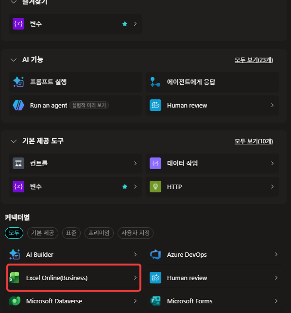

    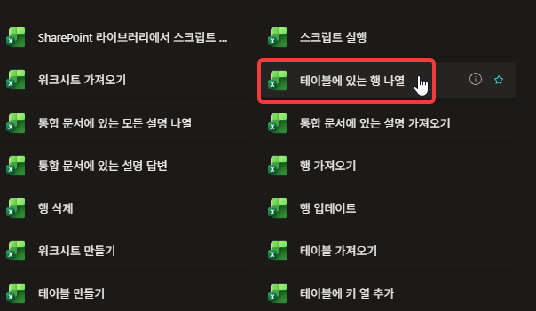

    {: .important }
    [Lab 5](./lab5.html) 6번에서 본 목록보다 넓습니다. 「행 삭제」·「행 업데이트」·「테이블 만들기」까지 있습니다. [Lab 5](./lab5.html) 23번에서 상태를 못 바꿨던 그 도구가 여기에는 있고, 우리는 쓰지 않습니다. **무엇을 안 붙일지도 설계입니다.**

7. 매개 변수를 채웁니다. 위치·문서 라이브러리·파일을 본인 것으로 고르고, 테이블은 **`단가표`** 로 지정합니다. 민감도 레이블 두 칸은 비워 둡니다.

    **완료 기준**: 파일 칸에 `/문서/정산_기준표.xlsx` 처럼 **경로가 보인다.**

    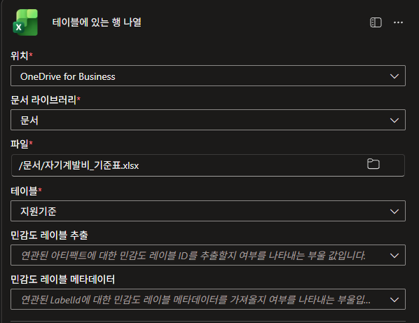

    {: .important }
    **[Lab 5](./lab5.html) 9번에서 `Table` 칸이 긴 코드였던 것을 떠올립니다.** 여기서는 파일도 테이블도 **사람이 읽을 수 있는 이름**으로 보입니다. 무엇을 가리키는지 눈으로 확인할 수 있습니다.

    {: .note }
    칸마다 **「AI로 동적으로 채우기」 선택지가 없습니다.** 흐름 안에서는 값을 내가 넣거나 앞 노드에서 받아옵니다.

8. 3번에서 본 **Respond to the agent** 노드를 엽니다. 출력 이름을 `결과` 로 두고, 값에 Excel 액션의 **`body/value`** 를 끼웁니다.

    **완료 기준**: 출력이 하나 있고 값이 앞 노드에 연결되어 있다.

    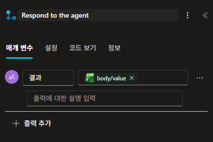

    {: .note }
    출력에도 **설명**을 붙일 수 있습니다. 오케스트레이터가 이 흐름의 결과를 어떻게 읽을지에 쓰이는 자리인데, 오늘은 비워 둡니다.

9. **초안 저장** 후 **게시**합니다. **완료 기준**: 게시 완료 표시가 뜬다.

    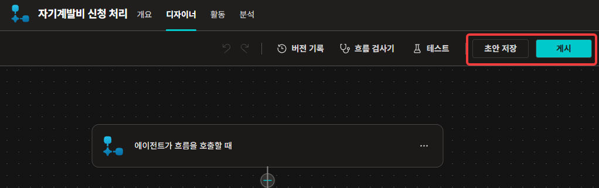

    {: .warning }
    흐름도 게시해야 에이전트가 부를 수 있습니다. 고칠 때마다 다시 게시합니다.

10. 툴바의 **테스트**를 누릅니다.

    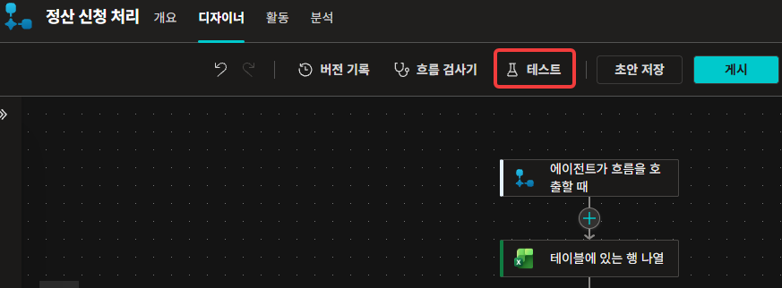

    **흐름 테스트**에서 **수동**을 고르고 **게시 및 테스트**를 누릅니다.

    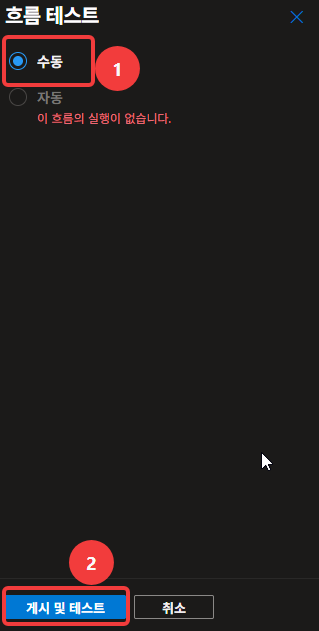

    {: .note }
    **자동**은 지난 실행을 다시 쓰는 방식인데, 처음이라 「이 흐름의 실행이 없습니다」로 막혀 있습니다.

    {: .note }
    버튼이 **게시 및 테스트**입니다. 9번에서 게시했더라도 테스트할 때 한 번 더 게시합니다. **고친 것이 반영되지 않았다면 여기부터 다시 눌러 봅니다.**

    **흐름 실행** 패널에 값을 넣고 **흐름 실행**을 누릅니다.

    ```
    구간코드   TR-03
    수량       4
    ```

    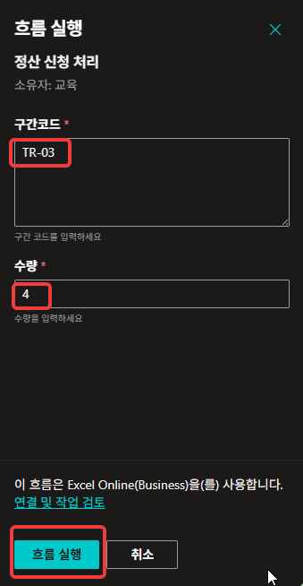

    {: .note }
    4·5번에서 만든 입력이 그대로 칸이 됐습니다. **형식도 따라옵니다** — `수량` 칸에는 숫자만 들어갑니다.

11. 실행하면 **활동** 탭으로 넘어갑니다. **완료 기준**: 노드 세 개에 소요시간과 체크가 붙는다.

    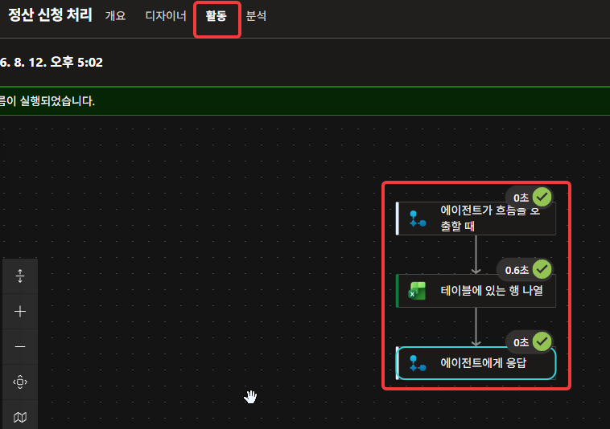

    {: .note }
    [Lab 4](./lab4.html)·[Lab 5](./lab5.html)의 **계약 테스트 창**과 같은 그림입니다. 거기는 에이전트 쪽에서 본 것이고 여기는 흐름 쪽에서 본 것입니다.

    **테이블에 있는 행 나열** 노드를 눌러 **출력**을 봅니다. `statusCode` 가 `200` 이면 호출은 성공입니다. 그 아래 **원시 출력 표시**를 누릅니다.

    

    **완료 기준**: `body` 의 `value` 에 **다섯 행이 전부** 들어 있다.

    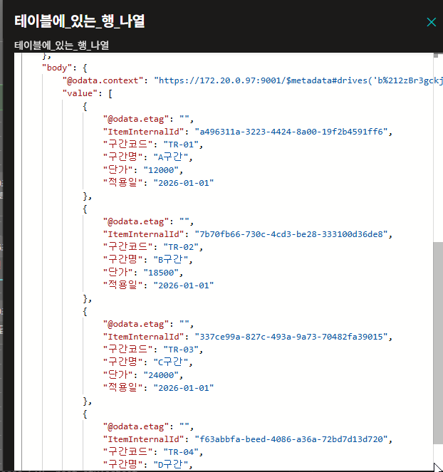

    {: .important }
    **아직 [Lab 5](./lab5.html)와 똑같습니다.** 흐름으로 감쌌을 뿐 읽어 오는 양은 그대로입니다. `TR-03` 하나를 물었는데 `TR-01`부터 `TR-05`까지 다 왔습니다. 조건을 거는 것은 다음 절에서 합니다.

    {: .note }
    `@odata.etag` 나 `ItemInternalId` 처럼 우리가 넣지 않은 값도 같이 옵니다. **읽어 오는 것은 표의 내용만이 아닙니다.**

## 단계 — ② 읽는 조건을 내가 정한다 (10분)

12. 6번의 Excel 액션을 열고 **고급 매개 변수** 드롭다운을 펼칩니다. 여섯 개가 체크박스로 들어 있습니다.

    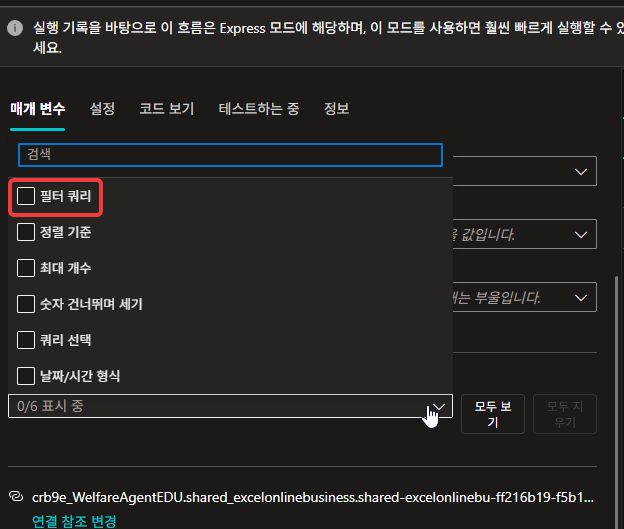

    **필터 쿼리**를 켜면 아래에 칸이 생깁니다. 아래처럼 채웁니다. 작은따옴표 **안쪽**에 4번의 입력을 끼웁니다.

    ```
    구간코드 eq '(입력: 구간코드)'
    ```

    **완료 기준**: 따옴표 두 개 사이에 `구간코드` 칩이 들어가 있다.

    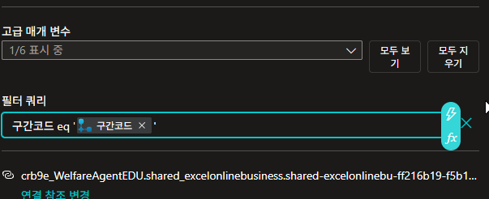

    {: .important }
    **같은 이름이 두 군데에 나옵니다.** 왼쪽의 `구간코드` 는 Excel 표의 머리글 이름이고, 따옴표 안의 파란 칩은 4번에서 만든 흐름의 입력입니다. 「표의 이 열이, 받은 값과 같은 행」이라고 읽습니다.

    {: .note }
    **칩은 글자가 아니라 참조입니다.** 실행할 때마다 그 자리에 받은 값이 들어갑니다. [Lab 4](./lab4.html) 22번의 메시지 변수, [Lab 5](./lab5.html) 10번의 지침 도구 지정과 같은 물건입니다. 칸에 직접 타이핑하면 그냥 글자가 되어 `TR-03` 을 찾는 대신 `구간코드` 라는 글자를 찾습니다.

    {: .important }
    **`구간코드`는 우리가 만든 Excel 표의 머리글 이름 그대로입니다.** 한글이어도 됩니다. `eq` 는 「같다」는 뜻이고, 이런 문법으로 조건을 씁니다.

    {: .warning }
    칩이 따옴표 **밖**에 나가면 실행 시 오류가 납니다. 값은 글자로 취급되므로 따옴표 안에 있어야 합니다.

    {: .note }
    칸 오른쪽의 `fx` 로 수식을 쓸 수도 있습니다. 오늘은 쓰지 않습니다.

13. 같은 드롭다운에서 **최대 개수**를 켜고 `1` 을 넣습니다.

    **완료 기준**: 표시 중인 항목이 둘이 되고, 최대 개수 칸에 `1` 이 들어간다. **초안 저장** 후 **게시**합니다.

    

    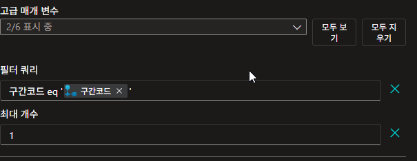

    {: .important }
    **필터가 있는데 왜 개수까지 정하나.** 필터는 「어떤 것을」이고 최대 개수는 「몇 개까지」입니다. 둘은 다른 질문입니다. `구간코드`는 표에서 유일하니 지금은 어차피 한 행이지만, **표가 그렇게 유지된다는 보장은 우리에게 없습니다.** 같은 코드가 두 줄 들어간 날, 필터만 있으면 두 행이 그대로 넘어옵니다.

    {: .note }
    **받는 쪽에서 미리 막는 것입니다.** 표가 잘못돼도 흐름은 한 행만 봅니다. 이런 자리를 「몇 개가 오든 알아서 처리하겠지」로 두면, 잘못됐을 때 어디서 어긋났는지 찾기 어려워집니다.

    {: .note }
    이름이 **「최대 개수」**입니다. 조건에 맞는 것이 그보다 적으면 적은 대로 옵니다. `0` 개일 수도 있고, 그 경우를 15번에서 봅니다.

14. 10번과 같은 값(`TR-03` · `4`)으로 다시 테스트하고, 11번처럼 **원시 출력**을 확인합니다.

    **완료 기준**: `value` 에 **한 행만** 들어 있고, 그 행이 `TR-03`이다.

    

    {: .important }
    **[Lab 5](./lab5.html) 11번에서 못 한 것이 이것입니다.** 거기서는 표를 통째로 받아 그중에서 골랐고, 여기서는 **필요한 한 줄만** 받습니다. 다섯 행짜리 표에서는 차이가 안 보이지만, 수천 행이면 매번 그 전부가 넘어가느냐 한 줄이 넘어가느냐의 차이입니다.

15. 없는 코드로 테스트합니다. `구간코드`에 `TR-99`, `수량`에 `1` 을 넣고 실행합니다.

    

    **완료 기준**: 오류가 아니라 `value` 가 **빈 배열**(`[]`)로 온다.

    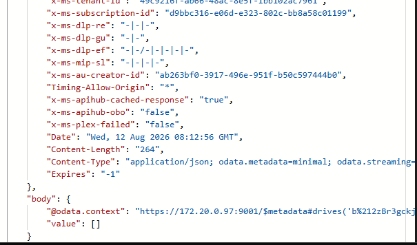

    {: .note }
    조건에 맞는 행이 없는 것은 실패가 아닙니다. `statusCode` 는 여전히 `200` 입니다. **없다는 사실이 결과입니다.** 다음 스텝에서 이것을 갈라냅니다.

16. Excel 액션 아래 **+** 에서 `조건` 을 검색해 **컨트롤** 묶음의 **조건**을 넣습니다.

    

    **완료 기준**: 조건 노드가 놓이고 아래가 두 갈래로 벌어진다.

    {: .note }
    검색하면 SharePoint 등 다른 커넥터의 비슷한 항목이 같이 나옵니다. **컨트롤** 아래의 것을 고릅니다.

17. 왼쪽 칸의 **`fx`** 를 눌러 수식 편집기를 열고, 아래를 **붙여넣습니다.**

    ```
    length(outputs('테이블에_있는_행_나열')?['body/value'])
    ```

    

    비교는 **다음과 같음**, 값은 `1` 로 둡니다.

    **완료 기준**: 캔버스가 **True**와 **False** 두 갈래로 나뉜다.

    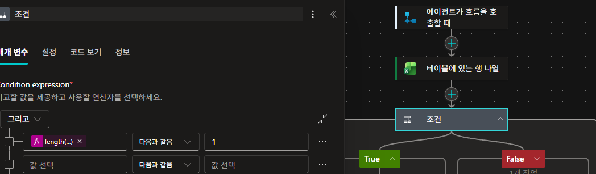

    {: .important }
    **동적 콘텐츠만으로는 안 됩니다.** 앞 노드가 돌려준 것은 **행 하나가 아니라 배열**입니다. 몇 개가 들어 있는지 세려면 `length` 같은 함수가 필요합니다. 13번에서 최대 개수를 `1` 로 둔 덕에 여기서 비교할 값도 `1` 하나면 됩니다.

    {: .note }
    직접 만들려면 편집기 아래 **기능** 탭에서 `length` 를 고르고, 괄호 안에서 **동적 콘텐츠** 탭으로 바꿔 앞 노드의 `value` 를 고릅니다. 결과는 같습니다. 오늘은 붙여넣고 넘어갑니다.

    {: .warning }
    수식 안의 `테이블에_있는_행_나열` 은 **6번에서 넣은 노드의 이름**입니다. 노드 이름을 바꿨다면 수식 안의 이름도 같이 바꿔야 합니다. 공백은 밑줄로 들어갑니다.

18. 3번에서 본 **에이전트에게 응답** 노드를 **True** 갈래로 옮깁니다. 그리고 **False** 갈래에 응답 노드를 하나 더 넣어, 출력 `결과` 에 아래를 씁니다.

    ```
    등록되지 않은 구간코드입니다.
    ```

    **완료 기준**: 두 갈래에 응답 노드가 하나씩 있다.

    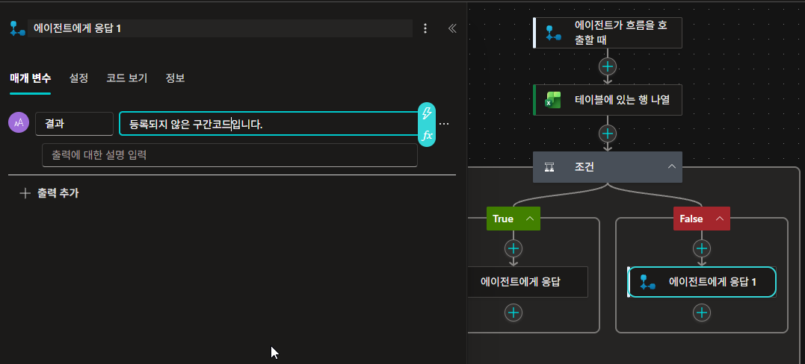

    {: .important }
    **출력의 이름과 형식은 흐름 전체에서 하나입니다.** 여기서 `결과` 를 텍스트로 정했으므로 True 갈래의 응답도 같은 이름, 같은 형식이어야 합니다. 갈래마다 다른 모양을 돌려줄 수는 없습니다.

    {: .note }
    부르는 쪽에서 보면 당연합니다. 오케스트레이터는 이 흐름이 무엇을 돌려주는지 **미리 알고** 부릅니다. 실행해 보고 나서야 모양이 정해지면 쓸 수가 없습니다. **입력에 형식을 정한 것(4·5번)과 같은 얘기가 출력 쪽에도 있습니다.**

    저장·게시하고 두 값으로 테스트합니다.

    | 입력 | 어느 갈래 | 결과 |
    |---|---|---|
    | `TR-01` | **True** | 원래 갈래로 간다 |
    | `TR-99` | **False** | 위 문장이 나온다 |

    **완료 기준**: 활동 탭에서 두 실행이 서로 다른 갈래를 탄 것이 보인다.

    

    

    {: .important }
    **찾은 쪽이 True입니다.** 정상 경로가 True 갈래이고, 못 찾은 경우가 False로 빠집니다. 갈래를 반대로 그리면 흐름을 읽을 때마다 한 번씩 헷갈립니다.

    {: .important }
    **[Lab 5](./lab5.html) 11번에서는 이 판단을 오케스트레이터가 했습니다.** 표를 다 보고 「없네요」라고 답한 것이고, 대체로 맞았지만 **매번 맞는다는 보장은 없었습니다.** 지금은 갈래가 그려져 있습니다.
{: start="12" }

## 단계 — ③ 쓰는 자리와 순서를 정한다 (11분)

19. 금액을 담을 변수를 만듭니다. **조건 노드보다 위**에 **변수 초기화**를 넣습니다. 이름 `금액`, 유형 **정수**, 값 `0`.

    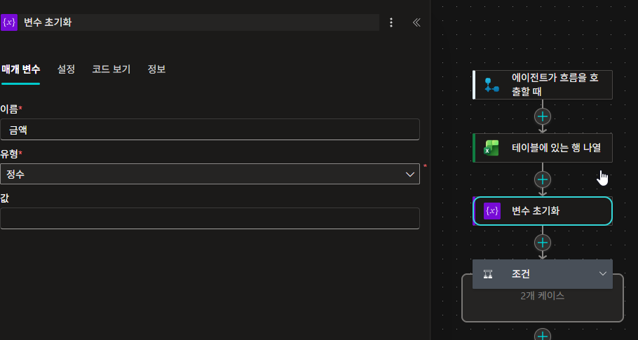

    {: .warning }
    **변수 초기화는 갈래 안에 넣을 수 없습니다.** True 갈래에 놓으면 저장이나 게시에서 막힙니다. 조건보다 위, 갈래가 갈라지기 전에 놓아야 합니다.

    {: .important }
    **[Lab 4](./lab4.html) 28번과 같은 얘기입니다.** 거기서도 변수를 갈래 앞에서 만들었습니다. 다른 점은 강도입니다 — 토픽에서는 갈래 안에 만들 수 있지만 값이 밖에서 안 보였고, 흐름에서는 아예 막습니다.

    이제 **True** 갈래에 **변수 설정**을 넣어 값을 채웁니다. 변수는 `금액`, 값에는 아래 수식을 **붙여넣습니다.**

    ```
    mul(int(first(outputs('테이블에_있는_행_나열')?['body/value'])?['단가']), triggerBody()?['number'])
    ```

    **완료 기준**: 조건 위에 초기화가, True 갈래에 설정이 하나씩 있다.

    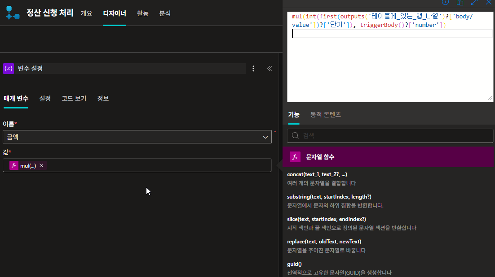

    

    {: .note }
    **변수 설정에서는 이름을 드롭다운으로 고릅니다.** 앞에서 초기화한 것만 목록에 뜹니다. 여기서 이름이 안 보이면 초기화가 갈래 안에 들어가 있는 것입니다.

    {: .warning }
    **수량을 `triggerBody()?['number']` 로 부릅니다.** 입력 이름(`수량`)이 아니라 **형식 이름**입니다. 입력이 여러 개면 `number_1`·`text_1` 처럼 번호가 붙으므로, 수식을 붙여넣은 뒤 값이 맞는지 한 번 실행해 확인합니다.

    {: .note }
    **수식이 세 겹입니다.** 안쪽부터 읽으면 `first` 로 배열의 첫 행을 꺼내고, `?['단가']` 로 그 행의 단가 칸을 집고, `int` 로 숫자로 바꾸고, `mul` 로 수량과 곱합니다. 붙여넣고 넘어가도 되지만, 어느 조각이 무엇인지는 한 번 짚어 두면 고칠 때 편합니다.

    {: .note }
    수식을 여기 두지 않고 21번의 `금액` 칸에 직접 넣을 수도 있습니다. 그러면 노드는 하나 줄지만 **계산한 자리가 화면에서 사라집니다.** [Lab 5](./lab5.html) 15번에서 없어서 아쉬웠던 것이 바로 그 자리입니다.

    {: .important }
    **16번에서 `length` 를 쓴 이유가 여기서 다시 나옵니다.** 앞 노드가 배열이라 `first` 로 한 행을 꺼내야 합니다. 최대 개수를 `1` 로 둔 덕에 **「첫 행」이 곧 「그 행」**입니다.

    {: .important }
    **[Lab 5](./lab5.html) 15번에서 화면에 없던 그 계산입니다.** 거기서는 모델이 문장 안에서 곱했고 기록이 남지 않았습니다. 여기서는 **노드로 남습니다.**

20. 그 아래에 **Excel Online (Business) → 테이블에 행 추가**를 넣습니다.

    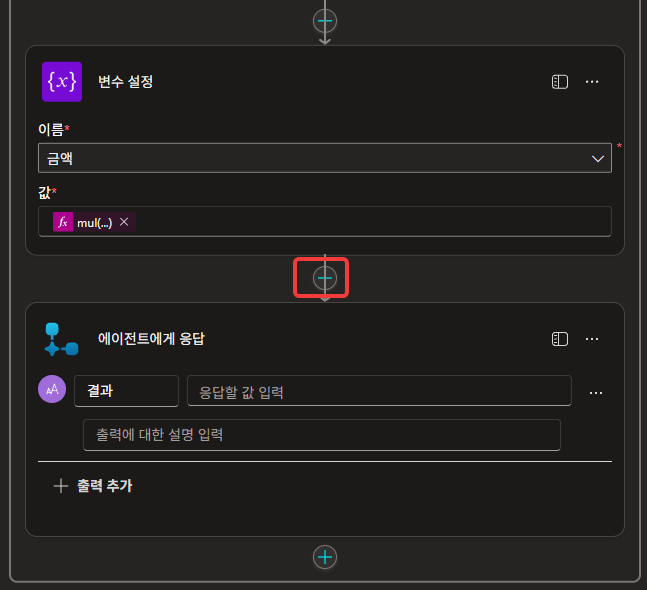

21. 위치·문서 라이브러리·파일을 고르고 테이블은 **`신청내역`** 으로 지정합니다. 표의 칸들은 **고급 매개 변수**에 들어 있으므로 **모두 보기**로 펼칩니다.

    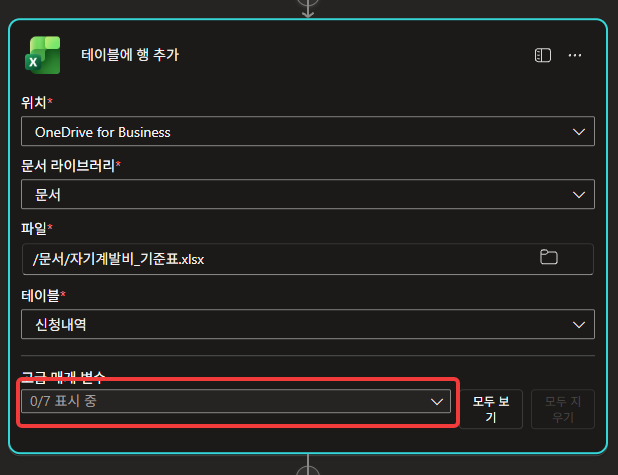

    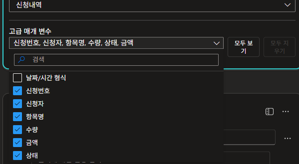

    다섯 칸을 아래처럼 채웁니다.

    | 칸 | 무엇을 넣나 |
    |---|---|
    | 신청자 | 본인 이름(글자로 직접) |
    | 구간코드 | 4번의 입력 칩 |
    | 수량 | 5번의 입력 칩 |
    | 금액 | 19번의 변수 칩 |
    | 상태 | `접수` (글자로 직접) |

    **완료 기준**: 다섯 칸이 채워지고, 그중 셋은 **칩**이다.

    

    {: .note }
    `신청번호` 는 비워 둡니다. 채울 값이 없기 때문입니다. **비워 두는 것도 정한 것입니다** — [Lab 5](./lab5.html) 24번에서 `신청자` 가 비었던 것은 정하지 않아서 빈 것이었습니다.

    {: .important }
    **[Lab 5](./lab5.html) 22·24번에서 값이 칸을 밀려 들어갔던 것이 여기서 해결됩니다.** 거기서는 대상 테이블만 고르고 나머지를 오케스트레이터가 짝지었습니다. 지금은 **칸마다 무엇을 넣을지 내가 잇습니다.** 한 번 이어 두면 다섯 건이든 백 건이든 같은 자리에 들어갑니다.

    {: .important }
    [Lab 5](./lab5.html) 24번에서 「5건 모두 정상 접수」라고 보고했던 것을 떠올립니다. 도구가 완료를 돌려주면 성공이고, 무엇이 들어갔는지는 아무도 확인하지 않습니다. **값이 맞는지는 실행 시점에 확인할 일이 아니라 여기서 한 번 정해 둘 일입니다.**

    {: .note }
    [Lab 5](./lab5.html) 22번에서 「형식을 지시해 맞추는 방법도 있다」고 했습니다. 그 방법은 **AI가 매번 해석**하고, 이 방법은 **한 번 이어 두면 그대로**입니다. 되돌릴 수 없는 작업에 어느 쪽이 맞는지가 이 랩의 답입니다.

    {: .important }
    **`상태`가 고정값인 것에 주목합니다.** 이 흐름으로는 `접수` 말고 다른 값을 넣을 수 없습니다. 승인이든 반려든, **여기 적히지 않은 값은 이 도구로 만들 수 없습니다.**

22. **True** 갈래의 **에이전트에게 응답** 노드를 엽니다. 출력 이름이 18번과 같은 `결과` · **텍스트**인지 확인하고, 값에 아래 수식을 붙여넣습니다.

    ```
    concat(triggerBody()?['text'], ' ', string(triggerBody()?['number']), '건 접수되었습니다. 금액 ', string(variables('금액')), '원')
    ```

    **완료 기준**: 두 갈래의 출력이 **같은 이름 · 같은 형식**이다.

    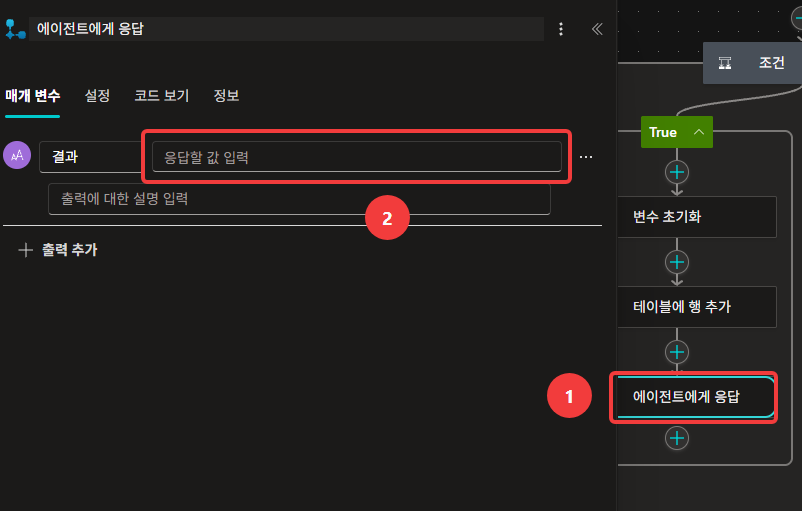

    

23. 저장하고 게시한 뒤, `TR-03` · `4` 로 테스트합니다. 활동 탭에서 **에이전트에게 응답** 노드의 **원시 출력**을 엽니다.

    **완료 기준**: `body` 에 `TR-03 4건 접수되었습니다. 금액 96000원` 이 들어 있다.

    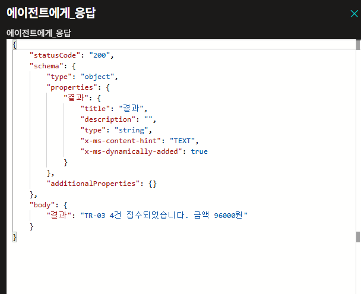

    {: .important }
    **`schema` 가 같이 나옵니다.** `결과` 의 이름과 `"type": "string"` 이 응답에 함께 실려 갑니다. 18번에서 「출력의 이름과 형식은 흐름 전체에서 하나」라고 한 것이 이것입니다 — **오케스트레이터는 이 스키마를 보고 흐름을 부릅니다.** 갈래마다 모양이 다르면 스키마를 만들 수 없습니다.

    이어서 **OneDrive에서 Excel 파일을 열어** 확인합니다.

    **완료 기준**: `신청내역` 에 한 줄이 추가되어 있고, **값이 제자리에 들어가 있다.**

    

    {: .important }
    **[Lab 5](./lab5.html) 24번과 같은 표를 열었습니다.** 거기서는 `구간코드` 에 `교육`이, `금액` 에 `TR-01` 이 들어갔습니다. 지금은 `구간코드`에 `TR-03`, `수량`에 `4`, `금액`에 `96000`, `상태`에 `접수` 가 각자 자리에 있습니다. **21번에서 칸마다 이어 둔 결과입니다.**

24. 에이전트로 돌아가 **도구 추가**를 열고 **흐름** 탭에서 `정산 신청 처리` 를 고릅니다.

    

    

    **설명**을 아래로 씁니다.

    ```
    정산 신청 한 건을 처리한다. 구간코드로 단가를 조회해 금액을 계산하고 신청내역에 접수로 기록한다. 등록되지 않은 구간코드는 기록하지 않는다.
    ```

    **완료 기준**: 도구 목록에 흐름이 보인다.

    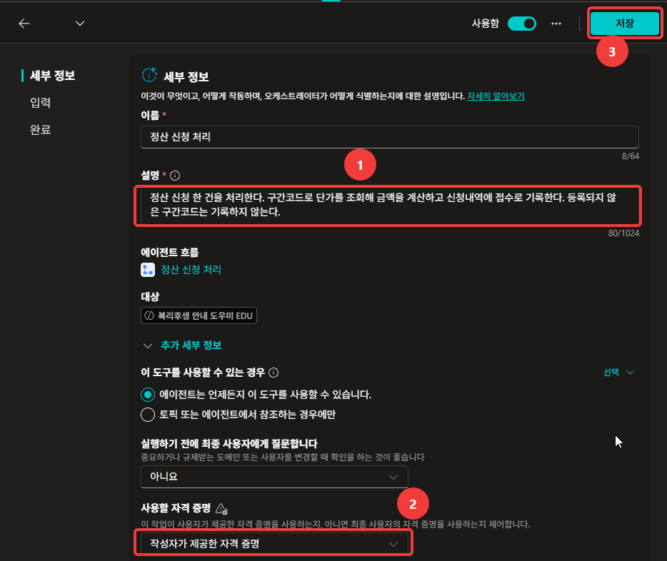

    {: .note }
    오늘 다섯 번째로 같은 얘기입니다. 오케스트레이터가 이 흐름을 언제 부를지는 **이 설명**이 정합니다.

    {: .warning }
    목록에 **남이 만든 흐름도 보입니다.** 같은 환경을 45명이 쓰고 있습니다. 이름으로 본인 것을 가려내야 합니다.

25. **새 테스트 세션**에서 신청합니다.

    ```
    TR-03으로 4건 정산 신청할게요
    ```

    **완료 기준**: 계약 테스트 창에 `정산 신청 처리` 가 **흐름**으로 기록되고, **상자가 하나**다.

    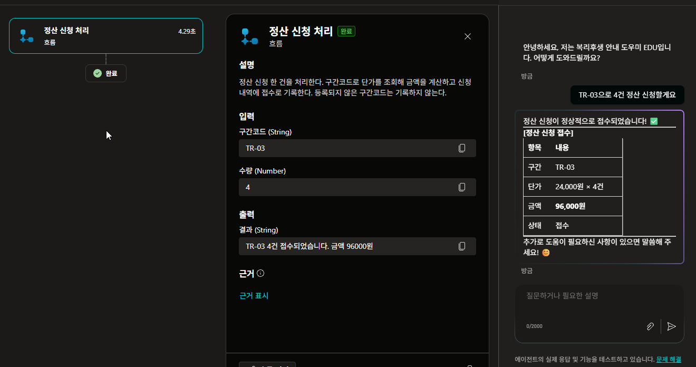

    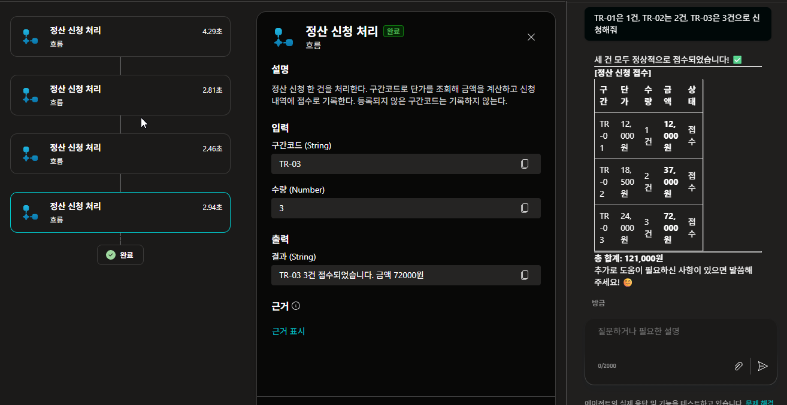

    {: .important }
    **[Lab 5](./lab5.html) 22번에서는 상자가 여러 개였습니다.** 조회 따로, 쓰기 따로였고 그 사이는 오케스트레이터가 이었습니다. 지금은 **상자가 하나**입니다. 그 안의 순서는 우리가 그렸습니다.

    {: .note }
    라벨이 「흐름」입니다. [Lab 4](./lab4.html)의 「토픽」, [Lab 5](./lab5.html)의 「커넥터 동작」과 나란히 놓입니다. **무엇이 불렸는지뿐 아니라 어떤 종류가 불렸는지까지 구분됩니다.**

    {: .note }
    상세에 4·5번에서 정한 입력과 22번에서 조립한 출력이 그대로 보입니다. 흐름의 안쪽은 보이지 않습니다 — **오케스트레이터에게 이 흐름은 입력과 출력만 있는 도구입니다.**

26. 여러 건과 없는 코드를 잇달아 시켜 봅니다.

    ```
    TR-01은 1건, TR-02는 2건, TR-03은 3건으로 신청해줘
    TR-99로 2건 정산 신청할게요
    ```

    **완료 기준**: 앞은 흐름이 **세 번** 호출되고 합계까지 정리된다. 뒤는 18번에서 쓴 문장이 나오고 **기록되지 않는다.**

    

    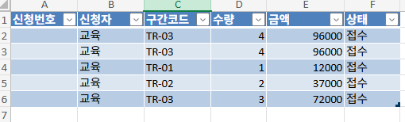

    {: .important }
    **흐름이 한 건만 받으니 오케스트레이터가 세 번 부릅니다.** 시키지 않아도 그렇게 나눕니다. 흐름의 입력 모양이 **어떻게 부를지까지 정하고 있는 것**입니다.

    {: .note }
    입력을 배열이나 JSON으로 받게 만들면 한 번만 부르고 흐름 안에서 반복하게 할 수도 있습니다. 어느 쪽이 나은지는 **한 건이 실패했을 때 나머지를 어떻게 할 것인가**로 갈립니다. 오늘은 한 건씩 갑니다.

    {: .important }
    **`TR-99`는 흐름 안에서 막혔습니다.** 오케스트레이터가 판단한 것이 아니라 18번에서 그린 갈래를 탄 것입니다. 몇 번을 다시 물어도 같은 답이 나옵니다.
{: start="19" }

## 단계 — ④ 같은 요청, 다른 결과 (4분)

27. **도구 목록**에서 [Lab 5](./lab5.html) 19번에 붙인 **테이블에 행 추가**를 찾아 **사용 설정** 토글을 끕니다.

    **완료 기준**: 도구는 목록에 남아 있고 사용만 꺼진다.

    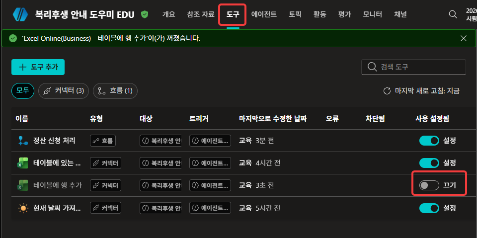

    {: .note }
    지우지 않고 **끕니다.** 껐다 켤 수 있어야 같은 요청으로 앞뒤를 비교할 수 있습니다. 실무에서도 도구를 뺄 때는 먼저 끄고 지켜봅니다.

28. [Lab 5](./lab5.html) 23번에서 했던 두 요청을 **그대로** 다시 합니다.

    ```
    신청내역 전부 상태를 승인으로 바꿔줘
    TR-01부터 TR-05까지 각 1건씩 전부 신청하고 기록해줘
    ```

    **완료 기준**: 앞은 [Lab 5](./lab5.html) 때처럼 **여전히 못 합니다.** 뒤는 흐름이 **다섯 번** 호출된다.

    

    {: .important }
    **앞의 요청이 안 되는 이유가 달라졌습니다.** [Lab 5](./lab5.html)에서는 그 일을 할 도구가 없어서였고, 지금은 남은 도구가 `상태`에 `접수`만 넣도록 그려져 있어서입니다. `승인`은 어디에도 적혀 있지 않습니다.

29. **OneDrive에서 Excel 파일을 열어** [Lab 5](./lab5.html) 24번의 표와 견줍니다.

    **완료 기준**: 다섯 줄이 들어가 있고, **값이 전부 제자리에** 있다.

    

    {: .important }
    **같은 요청인데 결과가 다릅니다.** 달라진 것은 도구 구성뿐입니다. [Lab 5](./lab5.html) 24번에서는 값이 밀려 들어갔고, 지금은 21번에서 이어 둔 자리에 그대로 들어갑니다.

    {: .important }
    다섯 건이 들어가는 것 자체는 여전히 막지 않았습니다. 확인도 받지 않습니다. 달라진 것은 한 건씩, 검증을 거쳐, 정해진 자리에 들어간다는 것입니다. **흐름은 일어날 일을 좁히는 도구이지 못 하게 막는 도구가 아닙니다.**

    {: .note }
    [Lab 1](./lab1.html) 부록에서 「능력이 없으면 사고도 없다」를 봤습니다. 그때는 쓰기 동작이 아예 없었기 때문이었고, 지금은 **쓰기를 하되 무엇을 어떻게 쓸지를 좁혀 둔** 상태입니다. 실무에서 쓸 수 있는 쪽은 뒤쪽입니다.
{: start="27" }

### 참고 — 실무에서는 흐름을 더 잘게 쪼갭니다

{: .note }
읽고 넘어가는 대목입니다. 만들지 않습니다.

오늘 만든 흐름은 **조회 · 계산 · 기록**을 한 덩어리로 합니다. 배우기에는 이 편이 낫지만, 실제로 쓸 것이라면 보통 더 나눕니다.

| 흐름 | 하는 일 | 왜 나누나 |
|---|---|---|
| 조회 | 구간코드로 단가를 찾아 돌려준다 | 바깥을 바꾸지 않는다. 몇 번 불려도 안전하다 |
| 등록 | 확정된 값을 신청내역에 기록한다 | 바깥을 바꾼다. 언제 불릴지가 중요하다 |
| 변경 | 신청번호 하나의 상태를 바꾼다 | 되돌리기가 가장 어렵다. 따로 두고 따로 관리한다 |

{: .important }
**나누는 기준은 「바깥이 바뀌는가」입니다.** 조회는 몇 번 불려도 그만이지만, 등록과 변경은 한 번 더 불리면 한 줄이 더 생깁니다. 셋을 한 흐름에 두면 **조회만 하고 싶을 때도 쓰기 권한이 딸려 옵니다.**

{: .note }
변경 흐름을 만든다면 입력은 **신청번호 하나**입니다. 「조건에 맞는 것 전부」가 아니라 「이것 하나」로 받으면, 잘못 불려도 한 줄만 바뀝니다. 26~28번에서 본 것과 같은 생각입니다.

---

## 단계 — ⑤ 도구를 데려온다 (9분)

30. **도구 추가**에서 위쪽 **새로 만들기**의 **모델 컨텍스트 프로토콜**을 고릅니다.

    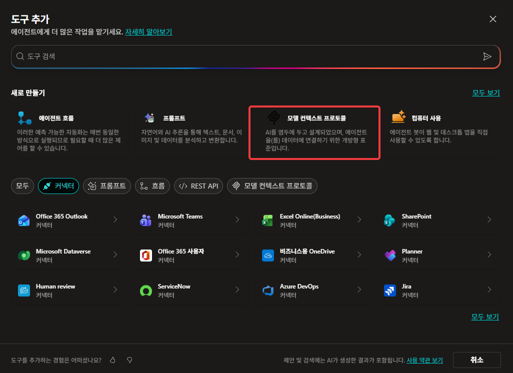

    {: .note }
    **MCP는 도구를 묶어서 주고받는 약속입니다.** 커넥터가 Microsoft가 만들어 둔 목록이라면, MCP는 누구든 서버를 열어 도구 묶음을 내놓을 수 있는 방식입니다. 그래서 카탈로그에서 고르지 않고 주소를 적어 등록합니다.

31. 서버 정보를 채웁니다.

    ```
    서버 이름   Microsoft Learn MCP
    서버 설명   Microsoft 의 공식 제공 기술문서 및 예제에 대한 Best Practice MCP 서버
    서버 URL    https://learn.microsoft.com/api/mcp
    인증        없음
    ```

    **완료 기준**: 네 칸이 채워지고 **만들기**가 활성으로 바뀐다.

    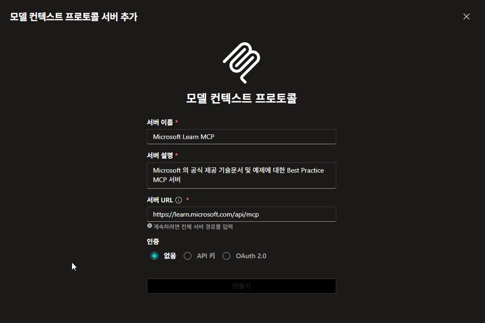

    {: .note }
    인증이 「없음」인 것은 이 서버가 공개 문서만 다루기 때문입니다. 사내 시스템을 MCP로 열면 API 키나 OAuth 2.0을 씁니다.

32. 만들고 나면 「사용자 지정 커넥터를 만들었습니다」가 뜨는데, **아직 추가되지 않았습니다.** 아래 **연결**이 「연결되지 않음」이고 **추가 및 구성**이 비활성입니다.

    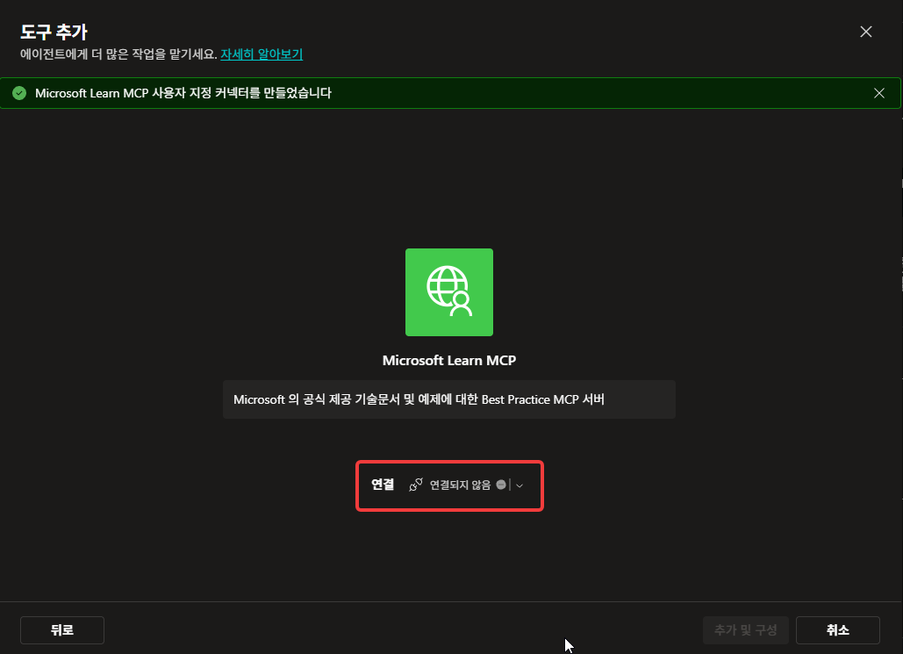

    **연결**을 눌러 연결을 만듭니다. 표시 이름은 비워 두어도 됩니다.

    **완료 기준**: 연결이 만들어지고 **추가 및 구성**이 활성으로 바뀐다.

    

    {: .important }
    **[Lab 5](./lab5.html) 3번에서 본 것과 같습니다.** 도구는 「무엇을 할 수 있는가」이고 연결은 「누구의 자격으로 하는가」입니다. **서버를 등록한 것과 그 서버를 쓸 수 있는 것은 다릅니다.** 인증이 「없음」이어도 연결은 따로 만들어야 합니다.

33. 추가하고 나서 서버를 열어 **도구** 항목을 봅니다.

    **완료 기준**: 서버 하나 아래에 **도구 셋**이 들어와 있다.

    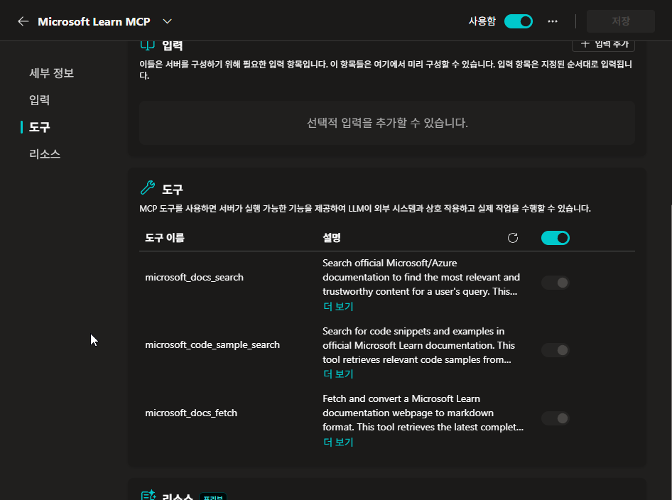

    | 도구 | 하는 일 |
    |---|---|
    | `microsoft_docs_search` | 공식 문서에서 관련 내용을 찾는다 |
    | `microsoft_code_sample_search` | 코드 예제를 찾는다 |
    | `microsoft_docs_fetch` | 문서 한 쪽을 통째로 가져온다 |

    {: .important }
    커넥터는 작업을 하나씩 골라 붙였습니다. [Lab 5](./lab5.html) 6번에서 「테이블에 있는 행 나열」 하나만 고른 것과 견줘 보면, **MCP는 묶음째 들어오고 안에서 하나씩 켜고 끕니다.**

    {: .note }
    도구마다 설명이 이미 붙어 있습니다. 서버를 만든 쪽이 써 둔 것입니다. **밖에서 데려온 도구는 그 설명도 같이 옵니다** — 우리가 쓸 일이 없는 대신 남이 쓴 것을 읽을 줄 알아야 합니다.

34. **새 테스트 세션**에서 물어봅니다.

    ```
    Copilot Studio에서 에이전트 흐름을 만드는 방법 알려줘
    ```

    처음에는 **연결 관리자를 열라**는 안내가 나올 수 있습니다.

    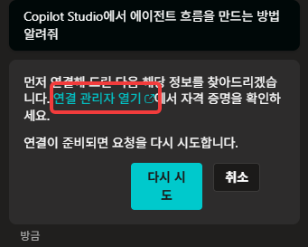

    링크를 눌러 **연결 관리**에서 `Microsoft Learn MCP` 의 상태를 확인합니다. 「연결되지 않음」이면 **연결**을 눌러 잇습니다.

    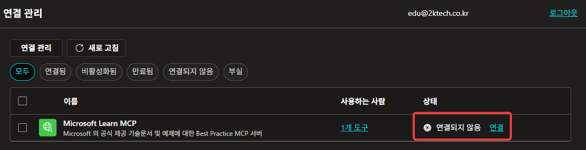

    

    돌아와 **다시 시도**를 누릅니다. **완료 기준**: 공식 문서를 근거로 답하고, 답 아래에 **참조**가 여러 개 붙는다.

    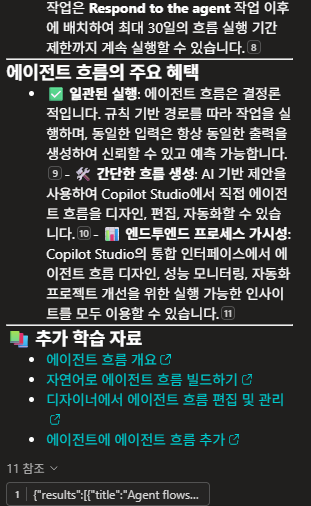

    {: .warning }
    **32번에서 연결을 만들었는데도 다시 물어봅니다.** 만드는 자리의 연결과 쓰는 자리의 연결이 따로 잡히는 경우가 있습니다. 안내가 뜨면 링크를 따라가 상태만 확인하면 됩니다.

    {: .note }
    참조를 펼치면 원문이 **구조화된 결과**로 보입니다. [Lab 3](./lab3.html)에서 웹사이트 참조가 **페이지 링크**였던 것과 다릅니다.

    {: .note }
    답에 「에이전트 흐름은 결정론적입니다. 동일한 입력은 항상 동일한 출력을 생성합니다」 같은 대목이 나옵니다. **오늘 ①~④에서 손으로 확인한 것을 공식 문서가 같은 말로 적어 둔 것**입니다.

35. **도구 목록**을 열어 오늘 얻은 것을 한 화면에서 봅니다.

    **완료 기준**: 위쪽 필터가 **커넥터(3) · 흐름(1) · 모델 컨텍스트 프로토콜(1)** 로 나뉘고, 27번에서 끈 도구가 **끄기** 상태로 남아 있다.

    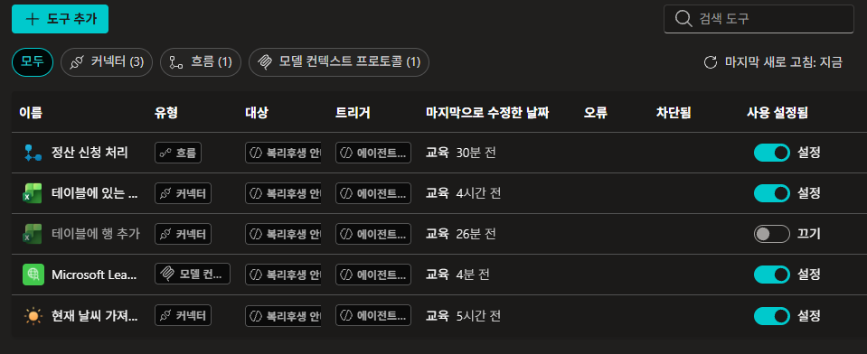

    | 얻은 방법 | 무엇 | 어디서 |
    |---|---|---|
    | 가져다 썼다 | 현재 날씨 가져오기 · 행 나열 · 행 추가 | [Lab 5](./lab5.html) |
    | 만들었다 | 정산 신청 처리 | Lab 6 ①~③ |
    | 데려왔다 | Microsoft Learn MCP | Lab 6 ⑤ |

    {: .important }
    **오케스트레이터에게는 셋 다 그냥 도구입니다.** 유형이 다르게 표시될 뿐, 고르는 기준은 언제나 **설명**이고 부르는 방법도 같습니다.

    {: .note }
    끈 도구가 목록에 회색으로 남아 있습니다. **무엇을 쓰지 않기로 했는지도 기록입니다.** 지웠다면 이 자리에 아무것도 없었을 것입니다.

    {: .important }
    [Lab 3](./lab3.html)에서 웹사이트를 지식으로 붙였던 것과 견줘 봅니다. 같은 「밖의 정보」인데 한쪽은 **지식**이고 한쪽은 **도구**입니다.

    | | [Lab 3](./lab3.html) 웹사이트 | Lab 6 MCP |
    |---|---|---|
    | 경로 | Bing 인덱싱을 거친다 | 서버에 직접 묻는다 |
    | 조건 | 로그인·깊이·리다이렉트·2,048자 | 주소와 연결만 있으면 된다 |
    | 받는 것 | 페이지 조각 | 구조화된 결과 |
    | 지식인가 도구인가 | 지식 | **도구** |
{: start="30" }

---

## 확인
- [ ] 트리거가 「에이전트가 호출하는 경우」로 고정된 흐름을 만들었다
- [ ] 입력을 **형식까지 정해** 선언했다
- [ ] **필터 쿼리**와 최대 개수로 읽어 오는 양을 내가 정했다
- [ ] 행 추가 액션에서 **칸마다 값을 이어** 값이 밀리지 않게 했다
- [ ] 조건 갈래로 「없는 코드」를 흐름 안에서 갈라냈다
- [ ] 조회 → 계산 → 기록을 **하나의 도구**로 묶었고, 계약 테스트 창에 상자가 하나로 뜨는 것을 확인했다
- [ ] 쓰기 도구를 끄고 **같은 요청**을 다시 했을 때 값이 제자리에 들어가는 것을 확인했다
- [ ] MCP 서버를 **주소로 등록**하고, 서버와 별개로 **연결**을 만들어야 하는 것을 확인했다
- [ ] MCP 서버 하나로 도구 여러 개가 한꺼번에 들어오는 것을 확인했다
- [ ] 커넥터 · 흐름 · MCP 세 가지가 오케스트레이터에게는 모두 도구라는 것을 말할 수 있다

---

## 부록 — 에이전트가 에이전트를 부른다

{: .time }
약 25분. **랩 진행에 필요하지 않습니다.** 시간이 남거나 나중에 혼자 해볼 몫입니다.

[Lab 2](./lab2.html)에서 만든 복리후생 에이전트를 **도구처럼 호출**하는 상위 에이전트를 만듭니다. 지금까지 붙인 커넥터·흐름·MCP 자리에 **에이전트**가 들어갑니다.

지금까지는 에이전트 **하나**에 지식·지침·토픽·커넥터를 계속 얹어왔습니다. 이 방식은 어느 지점에서 무너집니다.

| | 하나에 다 넣기 | 나눠서 부르기 |
|---|---|---|
| 지식이 늘어나면 | 엉뚱한 문서를 근거로 답하기 시작 | 담당 에이전트 안에서만 검색 |
| 지침이 늘어나면 | 규칙끼리 충돌, 매 요청 토큰 비용 증가 | 각자 짧은 지침 유지 |
| 담당이 바뀌면 | 전체를 건드려야 함 | 해당 에이전트만 교체 |
| 누가 답했는지 | 알 수 없음 | 추적 가능 |

{: .important }
[Lab 2](./lab2.html)에서 지침 몇 줄 차이로 응답이 갈리는 걸 봤습니다. 지침이 200줄이 되면 그 몇 줄이 어디 묻혔는지 아무도 모릅니다. **쪼개는 이유는 성능이 아니라 통제 가능성입니다.**

### 자식 준비

1. [Lab 2](./lab2.html) 에이전트를 열고 **설명**(Description) 란에 아래를 입력합니다.

    ```
    한별소프트의 복리후생·휴가·근태·경조사 제도를 사내 규정 문서에 근거해 안내합니다. 복지포인트, 연차/반차, 경조휴가와 경조금, 식대 지급 기준에 대한 질문을 처리합니다. 개인의 잔여 연차나 포인트 잔액 같은 실시간 개인 데이터는 다루지 않습니다.
    ```

    

    {: .warning }
    이 문장을 대충 쓰면 부록 8번이 성립하지 않습니다. 정확히 붙여넣습니다.

2. 에이전트 이름이 `복리후생 안내 도우미 HGD`(본인 이니셜)인지 확인합니다. 부모 쪽에서 이 이름으로 찾습니다.

3. 우측 상단 **게시**를 눌러 이 에이전트를 게시합니다.

    

    {: .note }
    다른 에이전트가 나를 도구로 부르려면 내가 **게시된 상태**여야 합니다. 편집 중인 초안은 남이 부를 수 없습니다.

### 부모 만들기

4. 에이전트 목록에서 **새 에이전트**를 만들고 이름을 지정합니다.

    ```
    사내 종합 안내 HGD
    ```

    

5. **지침** 란에 아래를 붙여넣고 저장합니다. 짧은 것이 핵심입니다.

    ```
    한별소프트 임직원의 사내 문의를 받는 1차 안내 창구입니다.

    - 직접 답하지 않습니다. 질문의 주제를 판단해 담당 에이전트에게 넘깁니다.
    - 담당 에이전트의 답을 받으면, 3줄 이내로 요약해 사용자에게 전달합니다.
      요약 끝에 어느 담당이 답했는지 한 줄로 표기합니다. 예: (담당: 복리후생 안내 도우미)
    - 담당 에이전트가 "모른다"고 답하면 지어내지 말고 그대로 전달합니다.
    - 담당이 없는 주제면 "담당 창구를 확인해 회신드리겠습니다"라고 안내합니다.
    ```

    

6. 부모의 **도구 → 도구 추가**에서 **에이전트** 항목을 고르고, **본인 이니셜이 붙은** `복리후생 안내 도우미 HGD`를 추가합니다.

    

    {: .important }
    방금 한 조작이 [Lab 5](./lab5.html)에서 MSN 날씨를 붙인 것과 **화면상 거의 똑같습니다.** 부모 입장에서 자식 에이전트는 그냥 **도구 하나**입니다.

### 호출 확인

7. 부모의 테스트 창에 아래를 입력합니다.

    ```
    본인 결혼하면 휴가 며칠이고 경조금은 얼마예요?
    ```

    **완료 기준**: 3줄 이내 요약과 `(담당: 복리후생 안내 도우미)` 표기가 붙는다. 부모는 이 지식을 갖고 있지 않으므로, 답이 나왔다면 자식이 불려간 것입니다.

    

8. **[경로 끊기]** 자식으로 돌아가 1번의 설명을 아래처럼 뭉갠 뒤 저장하고 **다시 게시**합니다.

    ```
    사내 안내 도우미입니다.
    ```

    부모 테스트 창에서 7번과 **똑같은 질문**을 다시 던집니다. **완료 기준**: 자식이 불려가지 않거나 판단이 흔들린다.

    

    {: .important }
    **부모는 자식의 내부를 보지 않습니다.** 부모가 읽는 것은 **설명 한 문단**뿐이고, 그것만으로 넘길지 말지를 정합니다. [Lab 4](./lab4.html) 14번에서 오케스트레이터가 토픽 안을 보지 못했던 것과 같은 구조입니다.

9. **[경로 잇기]** 1번의 설명을 복원하고 다시 게시한 뒤, 같은 질문으로 재확인합니다.

10. 부모의 **계약 테스트 창**에서 이번 대화가 어느 도구를 거쳤는지 확인합니다.

    

    {: .note }
    표의 마지막 줄 — 「누가 답했는가를 추적할 수 있다」가 지금 화면에 있습니다. 하나에 다 넣었다면 이 기록은 존재하지 않았습니다.
