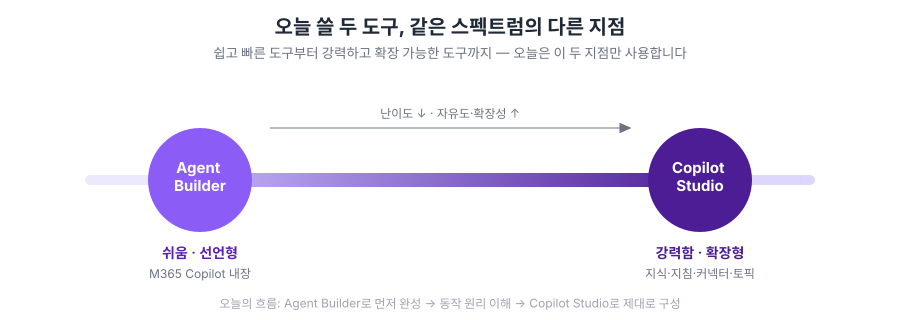
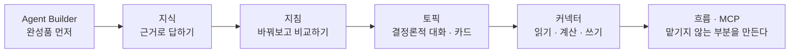

# Copilot Studio 입문 Lab 🌱

**"에이전트 하나를 손으로 만들어보면, 나머지는 응용입니다."**

가장 쉬운 도구로 뭔가 하나를 완성해보는 것부터 시작해서, [지식](./docs/glossary.html#knowledge)·[지침](./docs/glossary.html#instructions)·[토픽](./docs/glossary.html#topic)·[커넥터](./docs/glossary.html#connector)를 하나씩 손으로 붙여가며 나만의 에이전트를 완성합니다. 마지막에는 에이전트가 다른 에이전트를 부르는 것까지 만들어봅니다. 보고, 따라 하고, 붙여넣으면 완성됩니다.

{: .note }
이 사이트는 **입문 1일 과정**을 담습니다. 아래 Lab 1~6과 피날레로 하루가 구성됩니다.

---

## 오늘 쓸 두 도구

<!-- 저작 메모(2026-08-10): 기존 docs/opening.md를 이 홈으로 흡수했다.
     고객사 차수 시간표에서 08:30~08:45 인트로 슬롯이 "덱"이고 랩이 없으므로,
     랩 사이트에는 별도 오프닝 페이지를 두지 않고 홈이 그 역할을 겸한다.
     아래 SVG 2장은 원래 opening.md에 있던 것 — 덱에서도 같은 그림을 쓴다. -->

**[Agent Builder](./docs/glossary.html#agent-builder)** (M365 Copilot 내장, 선언형·쉬움)와 **[Copilot Studio](./docs/glossary.html#copilot-studio)** (확장형·강력함). 같은 스펙트럼의 다른 지점입니다.

---

## 하루의 흐름

가장 쉬운 도구로 먼저 완성품을 만져본 뒤, 지식을 붙이고, 지침을 바꿔가며 비교하고, 토픽으로 대화를 설계하고, 커넥터로 바깥 시스템에 손을 뻗습니다.

---

## 과정 구성

각 랩은 **타이머**로 페이스를 맞추며 진행합니다.

| 랩 | 분 | 내용 |
|---|---|---|
| [Lab 1. Agent Builder로 첫 에이전트](./docs/lab1.html) | 35 | 내 메일함으로 요약·답변초안 에이전트 + 가드레일 실험 |
| [Lab 2. 지식 기반 챗봇](./docs/lab2.html) | 40 | 오케스트레이터 개념 · 지식 4종 · 지침 2단계 · 경계 검증 |
| [Lab 3. 웹사이트를 지식으로](./docs/lab3.html) | 30 | 공개 사이트를 근거로 · 왜 어떤 사이트는 안 되는가 |
| [Lab 4. 토픽 → 적응형 카드](./docs/lab4.html) | 60 | 설명이 트리거 · 입력 변수 · 슬롯 필링 · 조건 · Adaptive Card |
| [Lab 5. 커넥터 — 읽고, 계산하고, 쓴다](./docs/lab5.html) | 40 | 날씨 · Excel 단가표 조회 · 금액 계산 · 신청내역 기록 |
| [Lab 6. 도구를 만들고, 도구를 데려온다](./docs/lab6.html) | 50 | 에이전트 흐름으로 조건·순서 못 박기 · MCP 연결 |
| [피날레](./docs/finale.html) | 10 | 오늘 배운 것 · 안 배운 것 정리, 중급 예고 |

{: .note }
[참고. 에이전트 안에서 일어나는 일](./docs/reference-inside-the-agent.html)은 랩이 아니라 **읽고 짧게 실습하는 페이지**입니다. **1부**(RAG·인덱싱)는 Lab 2의 인덱싱 대기 시간에 흡수되어 추가 시간이 들지 않고, **2부**(토큰·비용)는 **별도 15분 슬롯**으로 편성합니다 — 앞뒤 랩과 의존이 없어 어디에 끼워도 되고, 시간이 밀리면 통째로 빼기 쉽습니다.

**핸즈온 합계 265분**(랩 6개). 표에 적힌 시간은 **손을 움직이는 시간만**입니다 — 랩마다 시작 전 개념 설명과 마무리 정리로 10분 정도가 더 붙어, 실제 진행은 325분 안팎이 됩니다.

{: .note }
각 랩 페이지 맨 아래에 **「축약 경로」** 블록이 있습니다. 진행이 밀리면 강사가 그 순서대로 스텝을 덜어냅니다 — 어디를 버리는지 미리 정해두었으니, 따라오지 못했다고 조바심 내지 않으셔도 됩니다.

---

## 이 과정의 세 가지 질문

**1. 에이전트는 무엇을 알고, 무엇을 모르는가**
[지식(Knowledge)](./docs/glossary.html#knowledge)에 넣은 문서는 기준이지 데이터가 아닙니다. Lab 2에서 만드는 복리후생 에이전트는 "제도는 알지만 내 잔여 연차는 모른다"는 경계를 명확히 지킵니다 — 이 경계 감각이 실무에서 에이전트를 설계할 때 가장 먼저 필요한 판단입니다.

**2. 결정론적인가, 생성형인가**
Lab 1~3까지는 질문을 던지면 에이전트가 알아서 라우팅했습니다([생성형 오케스트레이션](./docs/glossary.html#generative-orchestration)). Lab 4에서는 반대로 [트리거 문구](./docs/glossary.html#trigger-phrase)로 딱 정해진 대로만 움직이는 [토픽](./docs/glossary.html#topic)을 만들어보며, 언제 어느 방식이 맞는지 감을 잡습니다.

**3. 하나로 다 하는가, 나눠서 부르는가**
Lab 7에서는 에이전트 하나에 모든 지식·도구를 몰아넣는 대신, 잘 만든 에이전트를 **도구처럼 호출**해봅니다. 역할이 커질수록 쪼개는 게 유리해지는 지점이 어디인지 직접 봅니다.

> **핵심 가이드**
> 이 교육의 목표는 기능을 익히는 데서 끝나지 않습니다. 여러분이 자신의 업무를 보며 '여기에도 적용할 수 있겠다'는 생각을 스스로 떠올리고, 새로운 아이디어를 계속 만들어낼 수 있는 기반을 만드는 것입니다.

---

{: .note }
Lab 2 이후에 다루는 회사 이름·제도·금액·구간 코드는 모두 가상 설정(한별소프트)입니다. 실제 개인 정보를 시스템에 업로드하지 마세요.

---

[Lab 1부터 시작하기 →](./docs/lab1.html){: .btn .btn-purple }
